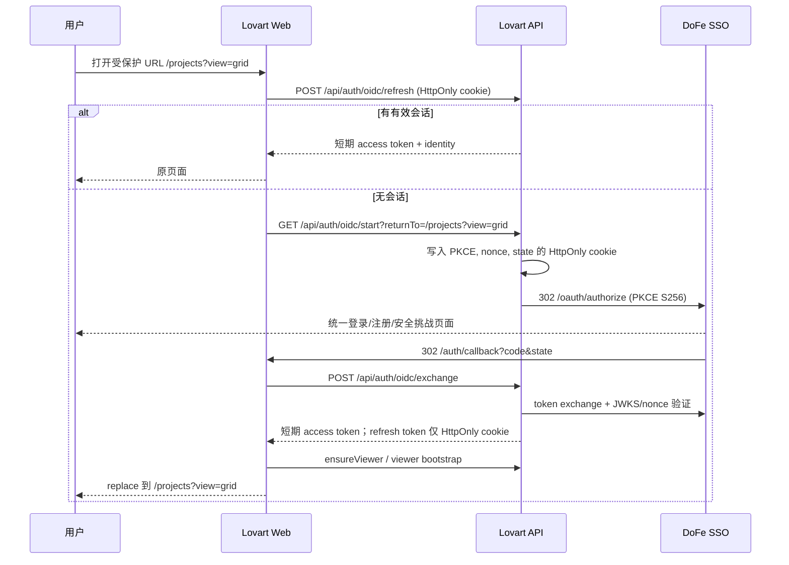
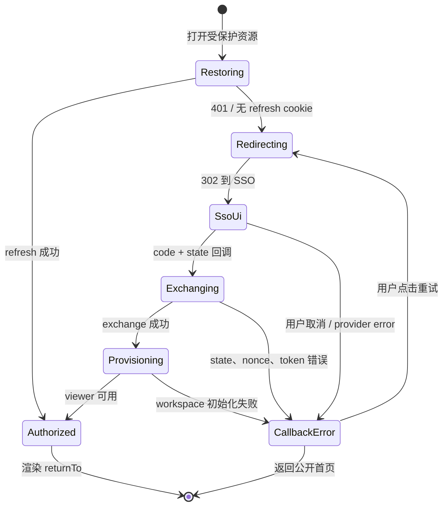

# Lovart.DoFe UI/UX 与统一 SSO 优化方案

> 状态：待评审
>
> 范围：`apps/web` 的产品体验、视觉系统和身份入口；身份认证仍由 `sso.ixicai.cn` 唯一承担。
>
> 目标：让用户从任意需要身份的操作直接进入 DoFe SSO，在完成授权后无损返回原始工作位置；同时以 SSO 的设计系统为唯一上游，消除 Lovart 与 DoFe 在语言、视觉密度、控件语义和反馈方式上的割裂。

> 实施状态：本仓库可实施项已完成。第 10 节记录每个“实施 -> 标注 -> 复审”循环；未经 SSO 外部契约确认的事项明确保留为阻塞项。

## 1. 决策摘要

### 1.1 必须达成的体验结果

1. Lovart 不再渲染登录或注册落地页，不再承载账号、密码、注册、找回密码、MFA 或账户安全的交互。
2. 所有公开的“登录”“开始创作”“免费开始”入口以浏览器顶层跳转直达 `GET /api/auth/oidc/start`，该端点再以 302 进入 `sso.ixicai.cn`。
3. 从受保护工作区进入时，完成一次静默会话恢复；确认无会话后立即转入 SSO，并保留完整的站内目的地（路径、查询参数、锚点）。不经过 `/login` 页面。
4. `sso.ixicai.cn` 是身份、注册、密码、安全策略、MFA、已连接应用和会话撤销的唯一事实来源。Lovart 只展示当前会话可安全使用的身份摘要与租户/团队上下文。
5. 以 SSO 维护的设计 token、Geist 字体、语义色和组件状态作为上游契约。Lovart 的画布创作表达可以保留，但工作区和授权交接不能再另起一套产品语言。

### 1.2 不改变的安全边界

- 保留 Fastify 的 authorization code + PKCE S256、`state`、`nonce`、JWKS 验签和服务端 token exchange。
- 刷新令牌继续只存于 `HttpOnly` cookie；前端只持有短期 access token，不能把 SSO client secret、refresh token 或内部 SSO API 暴露到 `NEXT_PUBLIC_*`。
- `returnTo` 继续仅接受同源相对路径，拒绝 `//` 和 `/\\`，防止开放重定向。
- `sso_user_mappings` 的 subject-to-profile 映射、首次 `ensureViewer`、租户/团队上下文及 Bearer JWT 校验均保持不变。

### 1.3 证据与前提

| 已核实 | 证据 | 设计含义 |
| --- | --- | --- |
| Lovart 已有完整 OIDC 框架 | `apps/server/src/http/oidc-auth.ts` | 不引入新的 auth SDK 或第二套用户库。 |
| SSO 支持 `authorization_code`、PKCE `S256`、refresh token、登出端点和 `ui_locales` | `https://sso.ixicai.cn/api/.well-known/openid-configuration`（2026-07-20 核验） | 可做直接跳转、无感续期及中英语言对齐。 |
| `/login` 及 `/register` 是本地中转界面 | `apps/web/src/app/login/page.tsx`、`apps/web/src/app/register/page.tsx` | 这是要移除的体验层，而非替换 OIDC 协议。 |
| 登录表单已在挂载后自动调用 `beginSsoLogin` | `apps/web/src/components/login-form.tsx` | 现状已经证明本地登录页没有业务价值，只增加一次闪现和失败分叉。 |
| 两端均使用 Geist / shadcn 风格的语义类名 | SSO 公共页面与 `apps/web/src/app/globals.css` | 先建立上游 token 契约，再做视觉收敛，避免通过截图猜色值。 |

**待 SSO 产品/前端确认，未确认前不得实现为假设：**

- SSO 的正式 token 源、版本号、组件变更策略及品牌资产授权方式。
- 新用户注册的授权页内入口或正式 `screen_hint`/注册 URL。公开 OIDC discovery 未声明注册意图参数，因此 Lovart 不应自行拼接未文档化参数。
- SSO 支持的 `post_logout_redirect_uri` 白名单及生产、预发、开发回调白名单。
- SSO 的 locale 优先级（`ui_locales`、cookie、用户偏好）与可接受语言集合。

## 2. 问题定义与设计原则

### 2.1 现状问题

| 问题 | 用户影响 | 根因 | 严重度 |
| --- | --- | --- | --- |
| 本地登录壳先出现，再自动跳 SSO | 用户误以为 Lovart 有独立账户；加载中可看到两次品牌切换 | `/login` 的 React 页面和 `LoginForm` 自动 effect | P0 |
| 登录、注册、授权失败都回到本地登录页 | 失败原因与重试位置不清晰，也违反唯一用户模块边界 | callback 使用 `loginErrorUrl()` | P0 |
| 工作区鉴权跳转丢失原路径 | 从项目、设置或画布被拉回 `/home` | workspace layout 固定 `router.replace("/login")` | P1 |
| 登出后再进入 `/login` | 用户刚退出仍被带到身份入口，而不是明确的公开状态 | `AppSidebar` 与服务端 logout 的回跳均指向 `/login` | P1 |
| UI 基础变量虽相似但没有上游治理 | 后续迭代会再次分叉；亮绿色 CTA、圆角和中英文文案不一致 | Lovart 自维护 `globals.css`，没有 token 发布契约 | P1 |
| 根文档为英语而 SSO 默认中文 | 同一条关键流程的语言切换突兀 | `RootLayout` 为 `lang="en"`，SSO 默认 `zh-CN` | P2 |

### 2.2 设计原则

1. **一个身份边界**：账户生命周期只在 SSO；Lovart 不复制任何身份表单或安全设置。
2. **路径连续性优先**：身份不是目的地。认证结束后回到用户原本要完成的操作，而非一律回首页。
3. **语义先于像素**：使用上游 `background`、`foreground`、`primary`、`muted`、`destructive` 等语义 token，不直接复制颜色值或截图样式。
4. **短、稳、可解释的反馈**：正常跳转无须多余落地页；只在交换、超时、拒绝和配置异常时显示明确、可恢复的交接状态。
5. **创作界面克制，品牌表达集中**：工作台用于高频操作，保持信息密度和稳定控件；品牌化动效放在公开营销区和作品展示，不侵入授权与编辑任务。
6. **可访问性是默认状态**：键盘顺序、明显焦点、语义 live region、色彩对比和减少动态效果不能作为后补项。

## 3. 目标信息架构与用户旅程

### 3.1 身份职责边界

| 领域 | 唯一所有者 | Lovart 的职责 |
| --- | --- | --- |
| 登录、注册、密码、MFA、恢复、可信设备 | DoFe SSO | 仅发起 OIDC authorization request。 |
| 身份资料、头像、已连接应用、会话撤销 | DoFe SSO | 展示 token/userinfo 中必要的摘要；“账号与安全”链接到 SSO。 |
| 本地 profile 与历史数据连续性 | Lovart 数据层 | 用 `sso_user_mappings` 映射 SSO subject，禁止用 email 作为持续身份键。 |
| 租户和团队成员关系 | DoFe SSO | 读取已有 tenant context，用于导航和资源授权展示。 |
| 项目、画布、技能、创作数据、额度 | Lovart | 保持已有业务、授权与数据模型。 |

### 3.2 目标站点结构

```text
Public
+-- /                         Landing / showcase / pricing entry
+-- /pricing                  Pricing
+-- /auth/callback            OIDC 交接页（仅短时加载或可恢复异常）
+-- /login, /register         兼容 URL：HTTP 直达 SSO，不渲染页面

Authenticated workspace
+-- /home                     创作入口和最近项目
+-- /projects                 项目
+-- /canvas                   画布
+-- /skills                   技能
+-- /brand-kit                品牌资产
+-- /settings                 产品设置；账户安全入口跳至 SSO
```

### 3.3 目标认证状态流



### 3.4 旅程与状态规格

| 场景 | 用户可见界面 | 行为 | 成功结果 | 失败/取消结果 |
| --- | --- | --- | --- | --- |
| Landing 点击“登录/开始创作” | 不展示本地登录页 | 原生链接进入 `/api/auth/oidc/start?returnTo=/home` | SSO 或已授权后的 `/home` | SSO 取消后进入 callback 交接异常页。 |
| Pricing 点击“免费开始” | 不展示本地注册页 | 同上，`returnTo=/pricing` 或定义好的购买后目标 | 回原页面并刷新登录态 | 保持公开 Pricing，不自动循环。 |
| 深链 `/projects/:id` | 最多显示中性“正在验证会话”占位 | refresh 为 401 后顶层跳 SSO | 原 URL（含 query/hash） | 回调异常页提供“重试”“返回公开首页”。 |
| 已有 SSO 会话 | SSO 可能短暂授权后自动回调 | 不要求再次输入凭证 | 小于 2 次导航完成回原页 | 无。 |
| SSO 明确拒绝/用户取消 | `auth/callback` 的异常状态 | 不自动重试 | 无 | 显示归因清晰的错误代码、重试和返回按钮。 |
| code/state 缺失、PKCE 失效、超时 | `auth/callback` 的异常状态 | 清理临时状态；记录安全日志 | 重试重新开始 | 不显示 token、code、state 或底层异常。 |
| 用户登出 | SSO 完成登出后回 `/` | 清除 Lovart 内存 session；服务端 revoke refresh token | Landing 显示轻量“已退出”提示 | revoke 失败不阻塞本地清理，记录事件。 |
| SSO 不可用/配置缺失 | 交接异常页 | 不重定向循环 | 无 | 说明“身份服务暂不可用”，提供重试和支持编号。 |

**交接页的边界：** `/auth/callback` 不是登录页。正常时仅展示不可交互的 1 秒级进度状态；异常时才展示一个窄幅状态面板。它不出现账号/密码字段、注册 CTA、双栏营销文案或独立账户叙事。

## 4. 统一 UI/UX 系统方案

### 4.1 上游 token 契约

SSO 不应通过抓取生产 CSS 被“复制”。应由 SSO 团队发布带语义和版本的包，例如 `@dofe/design-tokens`，Lovart 只消费该包。阶段一可将现有 `apps/web/src/app/globals.css` 迁移为该包的 CSS entry；阶段二由 CI 校验两端 token hash 一致。

```css
/* packages/design-tokens/src/index.css：概念契约，不是未经确认的最终色值 */
:root {
  --dofe-color-background: ...;
  --dofe-color-foreground: ...;
  --dofe-color-primary: ...;
  --dofe-color-muted: ...;
  --dofe-color-border: ...;
  --dofe-color-destructive: ...;
  --dofe-font-sans: Geist, system-ui, sans-serif;
  --dofe-radius-control: ...;
  --dofe-space-1: 4px;
  --dofe-space-2: 8px;
  --dofe-space-3: 12px;
  --dofe-space-4: 16px;
  --dofe-space-6: 24px;
  --dofe-space-8: 32px;
}
```

Lovart 的现有 `background`、`foreground`、`primary`、`muted`、`border`、`ring` 等 shadcn 语义变量映射到上游 token；业务组件不得再直接依赖 RGB/OKLCH 常量。画布内容、用户上传作品和生成结果不受此限制。

| 层级 | 规范 | Lovart 落地 |
| --- | --- | --- |
| 字体 | Geist Sans/Mono 为产品界面字体；字号随 token 输出 | 在 RootLayout 显式加载或引用统一字体，移除由浏览器默认决定的差异。 |
| 色彩 | 背景、文本、边框、主操作、危险、焦点均为语义 token | 保留 `primary` 高对比主操作；把当前营销区裸用的荧光色收回到经批准的品牌 accent。 |
| 间距 | 4px 基线，控件内部 8/12，区块 16/24/32 | 统一 sidebar、表单、弹窗、列表的密度。 |
| 圆角 | 由上游 `radius-control` 与 `radius-surface` 决定 | 工具和表单优先小圆角；仅营销展示允许胶囊按钮，不能用于工作区高频工具。 |
| 阴影与边框 | 以 1px 边界和低层级阴影区分层级 | 保留编辑器画布的空间层级，避免堆叠大卡片。 |
| 动效 | 150-200ms 反馈；进入/退出不超过 250ms | 移除认证页的装饰动画；遵从 `prefers-reduced-motion`。 |

### 4.2 组件治理

| 组件 | 统一规格 | 关键状态 |
| --- | --- | --- |
| Button | Primary、secondary、outline、ghost、destructive；图标优先用于工具操作 | default、hover、active、focus-visible、disabled、loading。高度和圆角从 token 获取。 |
| Input / Select | label 始终可见；帮助和错误与字段绑定 | default、focus、filled、disabled、error、success。 |
| Dialog / Popover | 仅用于明确的局部决策，焦点必须进入且可返回触发点 | opening、open、submitting、error、closed。 |
| Navigation | 当前项只用一个主信号（背景或文字），不叠加多个颜色 | default、hover、current、focus。 |
| Empty / Error | 图标、标题、原因、下一步动作；不要用装饰插画掩盖错误 | initial、loading、empty、recoverable error、blocked。 |
| Auth transfer | 中性全屏、产品识别、状态文本、可读进度 | checking、redirecting、exchanging、provisioning、failed。 |

`apps/web/src/components/ui/button.tsx` 是组件收敛的优先入口。现有 `base-ui` + CVA 可以保留，但视觉值、尺寸和 focus ring 应改由上游 token 驱动。禁止为“统一”而替换画布编辑器或重做成熟业务组件。

### 4.3 全局体验改进

1. **语言**：建立共享 locale resolver。默认跟随 SSO 的 `zh-CN`，用户显式选择后同时向 SSO authorization request 传 `ui_locales`，并在 Lovart 持久化偏好。所有认证、错误和系统状态必须同语言；页面标题与 `html lang` 同步。
2. **主题**：应用和 SSO 的 light/dark token 来自同一发布物。进入 SSO 前可携带已确认的 theme 偏好；未达成 SSO 协议前，不伪造 query 参数。两端都应在首帧避免闪烁。
3. **账号入口**：侧栏用户菜单保留“账户与安全”，其外链打开 SSO 的正式账户中心；不要在 Lovart Settings 复制密码、会话、MFA 页面。
4. **租户可见性**：`TenantTeamNav` 仅显示当前 tenant 和已授权团队；如果 SSO tenant context 不可用，显示“个人工作区”及解释性 tooltip，不能默认为任意团队。
5. **公开与工作区的分工**：Landing 可以继续以作品和生成结果驱动视觉感染力；工作区保持可扫描、低干扰、高对比的工具界面。不要把营销区的全圆角 CTA、浮动光晕和长动画带进编辑器、设置和授权流程。
6. **响应式**：受保护跳转不得先渲染桌面 sidebar 再跳转；移动端在 SSO 返回时回到原路径，底部导航不抢占 callback 状态焦点。

### 4.4 无障碍标准

- WCAG 2.2 AA：普通正文与背景至少 4.5:1，大文字至少 3:1；焦点轮廓至少 3:1。
- Auth transfer 用 `role="status"` + `aria-live="polite"` 报告“正在跳转到 DoFe 统一登录”“正在验证身份”，异常用 `role="alert"`；不向屏幕阅读器重复播报动画。
- 失败页的焦点落在标题，Tab 顺序为“重试 -> 返回公开首页 -> 支持链接”。
- 所有仅图标工具都保留可翻译的 `aria-label` 和 tooltip；当前 sidebar 已有基础 `aria-label`，继续沿用。
- `prefers-reduced-motion: reduce` 下禁用 logo 浮动、粒子、缩放和路由过渡，只保留必要进度指示。
- 在 320px、768px、1024px、1440px 宽度下验证文案不截断；认证异常操作按纵向排列，触控目标至少 44px。

## 5. 实施设计

### 5.1 路由与入口策略

统一使用以下构造函数，避免散落硬编码 URL：

```ts
// 概念 API，最终放在 apps/web/src/lib/sso-auth.ts
buildSsoStartHref(returnTo: string, locale?: "zh-CN" | "en-US"): string
redirectToSso(returnTo: string): never
getCurrentReturnTo(pathname: string, search: string, hash: string): string
```

规则：

- `returnTo` 在客户端先进行相对路径规范化，服务端 `safeReturnTo()` 仍是最终裁决。
- 公开页使用普通 `<a href>`，不是 `next/link` 的 SPA 路由，保证浏览器直接请求 Fastify 的 302 端点。
- 受保护页面在会话恢复明确返回 401 后用 `window.location.replace()` 顶层跳转，避免用户可回退到短暂未授权的工作区 DOM。
- `/login`、`/register` 仅为历史书签和外部链接保留兼容。它们必须在 HTTP 层 307/302 到 `/api/auth/oidc/start`，不能加载 `AuthProvider`、`AuthShell`、`LoginForm` 或 `RegisterForm`。
- `/auth/callback` 保留为唯一浏览器交接点。成功时用 `router.replace(returnTo)`；失败时停在 callback error view，不再跳转 `/login?error=...`。
- 登出后的 `post_logout_redirect_uri` 由 `${WEB_ORIGIN}/` 替代 `/login`。公开首页读取 `signed_out=1` 时显示无障碍状态提示；不得再次启动授权。

### 5.2 文件级迁移清单

| 文件/区域 | 改动 | 保留/删除 |
| --- | --- | --- |
| `apps/web/src/lib/sso-auth.ts` | 新增统一 start href、当前 URL 序列化、locale 传递与安全诊断枚举 | 保留 exchange、refresh、logout 调用。 |
| `apps/web/src/app/(workspace)/layout.tsx` | 用 `ProtectedRouteGate` 替换 `router.replace("/login")`，传递当前完整目的地 | 保留 loading 和已认证布局。 |
| `apps/web/src/app/auth/callback/page.tsx` | 以 auth transfer 状态机和错误页替换 `loginErrorUrl()` | 保留 code/state exchange、`fetchViewer`、超时保护。 |
| `apps/web/src/app/login/page.tsx`、`register/page.tsx` | 改为无渲染 HTTP redirect/静态兼容策略；生产部署必须验证静态导出限制 | 删除 `AuthShell` 使用。 |
| `apps/web/src/components/login-form.tsx`、`register-form.tsx`、`auth/auth-shell.tsx` | 在兼容窗口结束后删除 | 删除本地身份叙事与动画。 |
| Landing、pricing 的 CTA | 全部改为 `buildSsoStartHref()` 生成的原生链接 | 保留文案但统一为“使用 DoFe 账户继续”。 |
| `apps/web/src/components/app-sidebar.tsx` | 登出后不再 `router.replace("/login")`；让 `signOut()` 的 SSO logout URL 完成回跳 | 保留显式登出控制。 |
| `apps/server/src/http/oidc-auth.ts` | logout 回跳为公开首页；为 start/exchange/refresh/logout 添加关联 ID 和脱敏结果日志；按 SSO 确认后传 `ui_locales` | 保留 PKCE、cookie scope、token exchange、JWKS。 |
| `apps/web/src/app/globals.css` 与 `packages/ui` | 接入版本化 design tokens，删除未治理的产品级裸色值 | 保留 canvas 专用覆盖样式。 |
| 测试 | 旧 login/register UI 测试替换为 HTTP 直跳、深链回归、callback 异常和 logout 回跳测试 | 保留 OIDC PKCE 与 session refresh 测试。 |

### 5.3 `output: "export"` 的部署约束

当前 `apps/web/next.config.ts` 使用静态导出，因此 Next App Router 不能天然承接依赖 query 的 server redirect。实现时按部署模式选择，不得只在 `next dev` 正常：

| 部署模式 | `/login`、`/register` 兼容方案 | 验收要求 |
| --- | --- | --- |
| Nginx + Fastify（当前本地参考） | 在 Nginx 以精确 location 302 到 `/api/auth/oidc/start?returnTo=...`，或由 Fastify 提供兼容端点 | `curl -I` 不返回 HTML。 |
| 静态托管 + API 同域 | 在 CDN/Vercel rewrite/redirect 层配置 302，保留 `/api` 不被 SPA fallback 吞掉 | 生产 headers 与本地一致。 |
| 改为 Next SSR | 用 server component/route handler 307，并用 search params 构造安全目的地 | 不再使用 `output: "export"`，需评估成本。 |

这里推荐前两种，保持 Web 静态部署与 Fastify 的现有所有权。将 `/login` 改为 client `useEffect` 自动跳转不满足目标，因为它仍会先渲染本地页面。

### 5.4 授权交接状态机



错误文案使用用户可行动的枚举，而不是原始后端信息：

| 代码 | 用户文案 | 主操作 | 日志原因 |
| --- | --- | --- | --- |
| `cancelled` | “你已取消 DoFe 账户授权。” | 再次使用 DoFe 账户继续 | provider error code |
| `callback_invalid` | “登录信息不完整或已失效。” | 重新开始 | code/state 缺失或 PKCE 不匹配 |
| `exchange_failed` | “DoFe 无法验证此次授权。” | 重新开始 | token/JWKS/nonce，不记录凭证 |
| `workspace_unavailable` | “账户已验证，但工作区暂时无法打开。” | 重试打开工作区 | viewer bootstrap 分类错误 |
| `timeout` | “身份验证耗时过长。” | 重新开始 | 当前状态、耗时 bucket |
| `service_unavailable` | “统一身份服务暂时不可用。” | 重试 | 上游状态码 bucket/config 状态 |

### 5.5 可观测性与隐私

服务端已有 `oidc_authorization_started`、`oidc_exchange_completed`、`oidc_exchange_failed`、`oidc_session_refreshed`、`oidc_logout_completed` 日志。迁移时扩展为结构化、可关联但不可识别泄漏的事件：

| 事件 | 必填字段 | 禁止记录 |
| --- | --- | --- |
| `oidc_authorization_started` | `requestId`、`returnToRoute`、`locale`、`entryPoint` | state、nonce、code verifier、完整 query。 |
| `oidc_callback_received` | `requestId`、`providerOutcome`、`durationMsBucket` | authorization code、state。 |
| `oidc_exchange_completed` | `requestId`、`userIdHash`、`returnToRoute`、`hasTenantContext` | token、email、refresh token。 |
| `oidc_exchange_failed` | `requestId`、`failureCategory`、`upstreamStatusBucket` | error response body、JWT、cookie。 |
| `oidc_logout_completed` | `requestId`、`revocationOutcome` | refresh token。 |
| `auth_transfer_viewed`（前端分析） | `flowId`、`state`、`durationMsBucket`、`entryPoint` | PII、URL query、身份标识。 |

`requestId` 由 API 生成并作为安全响应头回传；错误页显示该 ID 以便支持排查。前端 `flowId` 仅为本次导航的随机短 ID，生命周期不超过 tab session。日志保留期、访问权限和采样率按 DoFe 现有安全规范执行。

## 6. 分阶段交付

| 阶段 | 交付内容 | 依赖 | 完成条件 |
| --- | --- | --- | --- |
| 0. 对齐（1-2 天） | 确认 SSO token package、callback/logout 白名单、注册入口、locale/theme 协议；冻结迁移 PRD | SSO 产品、前端、平台 | 四项待确认决策都有 owner 和书面结果。 |
| 1. 直接跳转（2-3 天） | CTA 直达 SSO；workspace 深链 returnTo；/login、/register HTTP 兼容；logout 回首页 | 现有 API/proxy | 无认证态访问任何受保护路由不会先返回 login HTML。 |
| 2. 交接可靠性（2-3 天） | callback 状态机、可恢复错误页、关联日志、端到端回归 | SSO 测试 client | 所有错误不循环、不泄密、可重试。 |
| 3. 设计系统（1 个 sprint） | token package 接入、Typography/locale/theme 收敛、button/input/nav 审计 | SSO token 发布物 | token hash、视觉回归和 a11y 门禁通过。 |
| 4. 渐进发布（1 个 sprint） | feature flag、10% -> 50% -> 100%、仪表盘、旧路由观察期 | 数据分析/运维 | 指标不回退，旧 URL 30 天无异常后移除兼容代码。 |

**建议 feature flag：** `direct_sso_entry_v1` 只控制入口和 protected-route redirect，不改变 token exchange。按 `requestId` 和产品环境观察，不按用户身份做永久分叉。紧急回退只能回到“旧中转页”，不得回退安全校验或把登录逻辑移到客户端。

## 7. 测试、验收与度量

### 7.1 自动化测试

| 类型 | 场景 | 断言 |
| --- | --- | --- |
| Server unit | `/api/auth/oidc/start` | PKCE、`state`、`nonce`、HttpOnly/Secure/SameSite cookie、safe returnTo、locale 白名单。 |
| Server unit | logout | revoke 尝试后始终清本地 cookie，回跳 `/?signed_out=1`，不回 `/login`。 |
| Web unit | CTA | 所有 landing/pricing CTA 输出同一个 start href；不渲染 login/register form。 |
| Web unit | `ProtectedRouteGate` | 401 时 `window.location.replace` 到 start，保留 pathname/search/hash；有 session 时零跳转。 |
| Web unit | callback | 成功回原路径；取消/超时/invalid state/exchange/viewer 错误停在可访问的错误页。 |
| Browser E2E | 全新用户、已有 SSO 会话、已登出用户 | 真实 SSO 测试 client 完成全链路，检查 URL、cookie 属性、回跳和浏览器 Back 行为。 |
| Visual regression | 公开页、工作区、callback loading/error，light/dark，320/768/1440 | token、文本、焦点、布局无回归。 |
| A11y | auth transfer 与核心工作区 | axe 无严重问题；键盘和 `prefers-reduced-motion` 人工通过。 |

现有 `apps/web/test/login.test.tsx` 和 `register.test.tsx` 验证的是即将移除的中转 UI，应替换为“直接 navigation 不渲染页面”的测试。保留 `apps/server/src/http/oidc-auth.test.ts` 中的 PKCE 与 cookie 覆盖，并扩展登出和 returnTo case。

### 7.2 发布验收清单

- [ ] 在 `curl -I https://<lovart>/login` 与 `/register` 上首响应为 302/307，目标是同源 OIDC start；响应体不是本地登录 HTML。
- [ ] `/projects?filter=mine#recent` 的匿名访问在成功认证后回到完全相同的 URL。
- [ ] SSO 已登录用户不看见账号密码、本地 AuthShell 或重复确认页。
- [ ] SSO 取消、拒绝、过期 code、PKCE 失败、token timeout、viewer 失败均无循环跳转；错误页有重试和退出路径。
- [ ] 所有 token、授权码、cookie 和 PII 不出现在 URL、浏览器 console、分析事件或应用日志。
- [ ] 登出后刷新任一受保护 URL 会重新开始 SSO，而公开首页可正常浏览。
- [ ] `ui_locales` 与 `html lang` 在中文、英文流程一致；缺省时回退策略符合 SSO 确认结果。
- [ ] 亮/暗主题、键盘焦点、减少动态效果、屏幕阅读器状态播报达到第 4.4 节要求。
- [ ] Token 包版本锁定，CI 对 Lovart 与 SSO 的 token hash/visual baseline 有门禁。

### 7.3 成功指标与门槛

| 指标 | 基线采集 | 上线门槛 | 目标 |
| --- | --- | --- | --- |
| 从 auth intent 到回到目标页的完成率 | 发布前 7 天 | 不低于基线 | >= 97% |
| P95 授权交接耗时 | 发布前 7 天 | 不增加 >10% | <= 5 秒（不含用户填写凭证时间） |
| callback 错误率 | 发布前 7 天 | 不增加 | < 1% |
| 用户取消后 24h 重试成功率 | 新增采集 | 观察 | >= 70% |
| 与 SSO token 视觉差异 | 建立截图基线 | 0 个未豁免差异 | 0 |
| Auth transfer WCAG AA 阻塞项 | 发布前审计 | 0 | 0 |
| 认证相关支持工单 | 发布前 30 天 | 不增加 | 30 天内下降 20% |

## 8. 风险、取舍与未决项

| 风险 | 后果 | 缓解措施 | Owner |
| --- | --- | --- | --- |
| 生产代理将 `/login` SPA fallback 到 `index.html` | 仍出现本地页面，破坏核心目标 | 发布前逐环境验证 response headers；为精确路径添加 redirect 规则 | 平台 |
| 未确认 SSO 注册入口便强行加参数 | 新用户无法注册或协议漂移 | 首期只进入标准 authorization endpoint；由 SSO 提供正式 UX/契约后再启用注册意图 | SSO 产品 |
| returnTo 缺失 hash 或被污染 | 用户丢上下文或开放重定向 | 统一 helper + 服务端白名单 + 单测/安全测试 | Web/Server |
| AuthProvider 初始 refresh 延迟造成界面闪烁 | 工作区短暂露出或跳转抖动 | ProtectedRouteGate 在 auth 结论前只显示中性占位；不挂载 workspace 内容 | Web |
| token 只做一次视觉复制 | 下一次 SSO 升级再次分叉 | package + semver + visual diff gate，禁止生产 CSS 抓取 | Design system |
| 错误日志泄露授权材料 | 安全事故 | 字段白名单、hash 身份、lint/review checklist、日志抽样 | Server/Security |

## 9. 评审结论

推荐批准“先收敛身份入口，再收敛设计系统”的顺序。第一阶段的价值直接且低风险：现有 SSO 与 OIDC 实现已经承担了认证核心，只需撤除本地中转界面、修复深链与错误/登出回跳。设计系统必须以 SSO 发布的正式 token 为依赖，不以视觉猜测替代协议；在此基础上，Lovart 可以保留其面向创作的产品气质，同时让用户在账号和工作区之间体验到同一个 DoFe 产品。

## 10. 实施闭环记录

| 循环 | 实施 | 实施后复审 | 文档标注 |
| --- | --- | --- | --- |
| 1 | 完成 `buildSsoStartHref()`、`getCurrentReturnTo()`、`replaceWithSsoLogin()`，并用单测覆盖安全 fallback 与 pathname/search/hash 保留。 | 后续入口和路由已有唯一 URL 构造点；仍有 CTA、workspace guard、callback 和 logout 在使用旧路径。 | 已完成；下一轮处理公开 CTA。 |
| 2 | Landing、Pricing 的全部 7 个旧 `/login`、`/register` CTA 已改为原生 `<a>`，统一指向 `buildSsoStartHref("/home")`。 | `rg` 复审确认公开组件中已不存在旧身份路由；普通站内导航继续使用 `next/link`。 | 已完成；新增 `public-sso-entry` 测试覆盖 Pricing 入口，下一轮处理受保护深链。 |
| 3 | workspace layout、Home、Projects、Canvas 和 `useCreateProject` 的未认证/401 分支已改用顶层 SSO replace，并通过 `getBrowserReturnTo()` 保留路径、query 与 hash。 | 令牌失效不再调用 `signOut()`，避免 revoke 后再发起登录的竞争；仅显式用户登出仍会走 SSO logout。 | 已完成；下一轮移除 callback 到 login 的失败分支，并实现交接异常 UI。 |
| 4 | 新增 `AuthTransferScreen`；callback 成功仍完成 exchange/viewer bootstrap 并回原路径，取消、缺 state、超时、exchange 和 bootstrap 失败均停留在可恢复的交接错误状态。 | 已移除 `loginErrorUrl()` 与所有 callback -> `/login?error=` 跳转。错误状态具有 `role="alert"`、标题焦点、重试与返回首页；加载状态具有 `role="status"` 和 live region。 | 已完成；下一轮清除本地登录/注册页面，并完成 proxy、logout 与测试部署兼容。 |
| 5 | 删除本地表单、AuthShell 及过期测试；Nginx 对历史 URL 在静态页面前执行 SSO redirect；logout 改回 `/?signed_out=1` 并记录 `revocationAttempted`；Landing 显示可访问的退出状态。`/login`、`/register` 仅保留无 UI 的静态 preview fallback。 | SSO logout endpoint、refresh cookie 清理和公开回跳已有服务端单测。Nginx 保留 API 端点所有权，避免 SPA fallback 吞掉历史身份 URL；fallback 不渲染任何登录内容。 | 已完成；本仓库内的五轮实施闭环结束。 |
| 6（审查修复） | 统一 Brand Kit、删除项目、Settings、Skills 的 401 进入 SSO；重试使用 sessionStorage 中经同源校验的原始目的地；logout 失败也回公开已退出页；OIDC 日志仅保留 route、hash identity 与失败类别；callback 显示安全 request ID；退出提示支持关闭并清理 query。 | 不再有业务层 `ApiAuthError -> signOut()`；callback 重试保留深链，OIDC 日志不再写入 raw return query、user ID 或异常对象。Vercel SPA rewrite 已排除 `/api`。 | 已完成；Vercel 仍需要同源 Fastify proxy/function，见外部/环境验收项。 |

### 外部阻塞项

- `@dofe/design-tokens` 的正式来源、版本与变更治理尚未由 SSO 团队提供，不能以抓取生产 CSS 代替。
- SSO 未公开注册意图参数或正式注册 URL；本次实现统一进入标准授权端点，不伪造 `screen_hint`。
- SSO 账户中心的正式外链以及 locale/theme 传递协议待其 owner 确认，因此不在本次客户端实现中猜测 URL 或 query 参数。

### 最终完成度矩阵

| 类别 | 状态 | 准确说明 |
| --- | --- | --- |
| 本地身份入口、受保护深链、callback、登出、Nginx 历史 URL 部署规则 | 已完成并自动验证 | Web/Server 自动化测试、两端 typecheck 与 Next 静态构建已通过。 |
| 本地登录/注册体验 | 已移除 | 不再有表单、AuthShell 或 callback -> `/login` 回退；静态 preview fallback 只执行无 UI 的顶层 redirect。 |
| SSO 设计 token、语言、主题与账户中心 | 外部阻塞 | 需要 SSO owner 发布正式 token/URL/protocol，不能通过推测或抓取生产页面实现。 |
| 真实 SSO 浏览器 E2E、生产代理 headers、视觉回归、axe 与指标基线 | 待环境验收 | 需要被白名单的 SSO 测试 client、部署环境和真实浏览器会话；已有自动化验收条目可直接执行。 |
| Vercel 静态部署 | 环境阻塞 | 已排除 `/api` 的 SPA rewrite，防止返回静态 HTML；仍须由平台提供同源 Fastify proxy 或 serverless API 后才能启用 Vercel 的历史 URL redirect。 |
