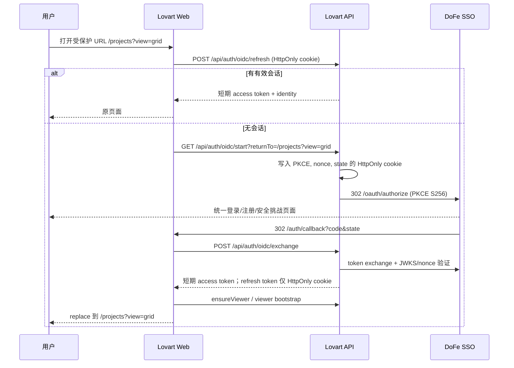
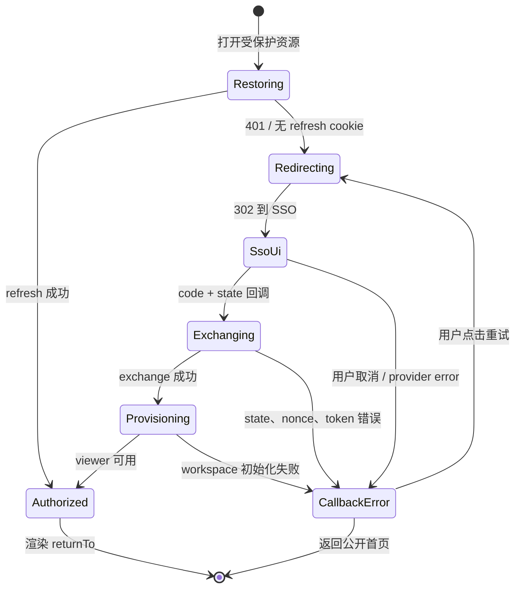

# Lovart.DoFe UI/UX 与统一 SSO 优化方案

> **2026-07-20 协议收敛更新：** 已核对 SSO 源码并落实客户端登记、OIDC 全局退出和 Discovery 真实性修复。以 [SSO 协议与设计契约](./sso-protocol-and-design-contract.md) 为准；它明确了 `/oauth/*` 端点、`id_token_hint` 退出、环境级客户端和共享 design token 发布边界。

> 状态：本仓库实施完成，待外部环境验收
>
> 范围：`apps/web` 的产品体验、视觉系统和身份入口；身份认证仍由 `sso.ixicai.cn` 唯一承担。
>
> 目标：让用户从任意需要身份的操作直接进入 DoFe SSO，在完成授权后无损返回原始工作位置；同时以 SSO 的设计系统为唯一上游，消除 Lovart 与 DoFe 在语言、视觉密度、控件语义和反馈方式上的割裂。

> 实施状态：本仓库可实施项已完成。第 10 节记录每个“实施 -> 标注 -> 复审”循环；未经 SSO 外部契约确认的事项明确保留为阻塞项。授权交接的仪表盘、告警和外部交付细节见 [可观测性运行手册](./auth-transfer-observability-runbook.md)。

## 1. 决策摘要

### 1.1 必须达成的体验结果

1. Lovart 不再渲染登录或注册落地页，不再承载账号、密码、找回密码、MFA 或账户安全的交互；SSO 当前仅支持已有账户登录，不提供自助注册。
2. 所有公开的“登录”“开始创作”“免费开始”入口以浏览器顶层跳转直达 `GET /api/auth/oidc/start`，该端点再以 302 进入 `sso.ixicai.cn`。
3. 从受保护工作区进入时，完成一次静默会话恢复；确认无会话后立即转入 SSO，并保留完整的站内目的地（路径、查询参数、锚点）。不经过 `/login` 页面。
4. `sso.ixicai.cn` 是身份、注册、密码、安全策略、MFA、已连接应用和会话撤销的唯一事实来源。Lovart 只展示当前会话可安全使用的身份摘要与租户/团队上下文。
5. 以 SSO 维护的设计 token、Geist 字体、语义色和组件状态作为上游契约。Lovart 的画布创作表达可以保留，但工作区和授权交接不能再另起一套产品语言。

### 1.2 不改变的安全边界

- 保留 Fastify 的 authorization code + PKCE S256、`state`、`nonce`、JWKS 验签和服务端 token exchange。
- 刷新令牌继续只存于 `HttpOnly` cookie；前端只持有短期 access token，不能把 SSO client secret、refresh token 或内部 SSO API 暴露到 `NEXT_PUBLIC_*`。
- `returnTo` 继续仅接受同源相对路径，拒绝 `//` 和 `/\\`，防止开放重定向。
- `sso_user_mappings` 的 subject-to-profile 映射、首次 `ensureViewer`、租户/团队上下文及 Bearer JWT 校验均保持不变。

### 1.3 实施前证据与前提

| 已核实 | 证据 | 设计含义 |
| --- | --- | --- |
| Lovart 已有完整 OIDC 框架 | `apps/server/src/http/oidc-auth.ts` | 不引入新的 auth SDK 或第二套用户库。 |
| SSO 支持 `authorization_code`、PKCE `S256`、refresh token 和受 `id_token_hint` 保护的登出端点 | SSO discovery、共享 Zod 契约与端点源码（2026-07-20 核验） | 可做直接跳转、无感续期及标准 RP 发起全局退出。 |
| `/login` 及 `/register` 曾是本地中转界面 | 实施前的 `apps/web/src/app/login/page.tsx`、`apps/web/src/app/register/page.tsx` | 已移除登录 UI；当前仅保留零 UI 静态 fallback 和生产代理 302。 |
| 登录表单曾在挂载后自动调用 `beginSsoLogin` | 实施前的 `apps/web/src/components/login-form.tsx` | 该组件已删除，证实本地登录页没有业务价值，只增加一次闪现和失败分叉。 |
| 两端均使用 Geist / shadcn 风格的语义类名 | SSO 公共页面与 `apps/web/src/app/globals.css` | 先建立上游 token 契约，再做视觉收敛，避免通过截图猜色值。 |

**待发布/产品确认，未确认前不得实现为假设：**

- `@dofe/design-tokens@0.1.0` 已发布并由 Lovart 锁定；后续仅需确认升级策略与品牌资产授权，不能通过相对路径绕过 npm 发布流程。
- SSO 当前仅允许登录，注册页被产品策略禁用；Lovart 的“免费开始”只表示无需本地注册费用，进入统一登录而不传递注册意图。
- SSO 支持的 `post_logout_redirect_uri` 白名单及生产、预发、开发回调白名单。
- SSO 的 locale 优先级已经固定为请求中第一个受支持的 `ui_locales`（`zh-CN`、`en`），Lovart 已以相同顺序传递该偏好。

## 2. 问题定义与设计原则

### 2.1 现状问题

| 问题 | 用户影响 | 根因 | 严重度 |
| --- | --- | --- | --- |
| 本地登录壳先出现，再自动跳 SSO | 用户误以为 Lovart 有独立账户；加载中可看到两次品牌切换 | `/login` 的 React 页面和 `LoginForm` 自动 effect | P0 |
| 登录、注册、授权失败都回到本地登录页 | 失败原因与重试位置不清晰，也违反唯一用户模块边界 | callback 使用 `loginErrorUrl()` | P0 |
| 工作区鉴权跳转丢失原路径 | 从项目、设置或画布被拉回 `/home` | workspace layout 固定 `router.replace("/login")` | P1 |
| 登出后再进入 `/login` | 用户刚退出仍被带到身份入口，而不是明确的公开状态 | `AppSidebar` 与服务端 logout 的回跳均指向 `/login` | P1 |
| UI 基础变量虽相似但没有上游治理 | 后续迭代会再次分叉；亮绿色 CTA、圆角和中英文文案不一致 | Lovart 自维护 `globals.css`，没有 token 发布契约 | P1 |
| 根文档为英语而 SSO 默认中文 | 同一条关键流程的语言切换突兀 | `RootLayout` 为 `lang="en"`，SSO 默认 `zh-CN` | P2 |

### 2.2 设计原则

1. **一个身份边界**：账户生命周期只在 SSO；Lovart 不复制任何身份表单或安全设置。
2. **路径连续性优先**：身份不是目的地。认证结束后回到用户原本要完成的操作，而非一律回首页。
3. **语义先于像素**：使用上游 `background`、`foreground`、`primary`、`muted`、`destructive` 等语义 token，不直接复制颜色值或截图样式。
4. **短、稳、可解释的反馈**：正常跳转无须多余落地页；只在交换、超时、拒绝和配置异常时显示明确、可恢复的交接状态。
5. **创作界面克制，品牌表达集中**：工作台用于高频操作，保持信息密度和稳定控件；品牌化动效放在公开营销区和作品展示，不侵入授权与编辑任务。
6. **可访问性是默认状态**：键盘顺序、明显焦点、语义 live region、色彩对比和减少动态效果不能作为后补项。

## 3. 目标信息架构与用户旅程

### 3.1 身份职责边界

| 领域 | 唯一所有者 | Lovart 的职责 |
| --- | --- | --- |
| 登录、注册、密码、MFA、恢复、可信设备 | DoFe SSO | 仅发起 OIDC authorization request。 |
| 身份资料、头像、已连接应用、会话撤销 | DoFe SSO | 展示 token/userinfo 中必要的摘要；“账号与安全”链接到 SSO。 |
| 本地 profile 与历史数据连续性 | Lovart 数据层 | 用 `sso_user_mappings` 映射 SSO subject，禁止用 email 作为持续身份键。 |
| 租户和团队成员关系 | DoFe SSO | 读取已有 tenant context，用于导航和资源授权展示。 |
| 项目、画布、技能、创作数据、额度 | Lovart | 保持已有业务、授权与数据模型。 |

### 3.2 目标站点结构

```text
Public
+-- /                         Landing / showcase / pricing entry
+-- /pricing                  Pricing
+-- /auth/callback            OIDC 交接页（仅短时加载或可恢复异常）
+-- /login, /register         兼容 URL：HTTP 直达 SSO，不渲染页面

Authenticated workspace
+-- /home                     创作入口和最近项目
+-- /projects                 项目
+-- /canvas                   画布
+-- /skills                   技能
+-- /brand-kit                品牌资产
+-- /settings                 产品设置；账户安全入口跳至 SSO
```

### 3.3 目标认证状态流



### 3.4 旅程与状态规格

| 场景 | 用户可见界面 | 行为 | 成功结果 | 失败/取消结果 |
| --- | --- | --- | --- | --- |
| Landing 点击“登录/开始创作” | 不展示本地登录页 | 原生链接进入 `/api/auth/oidc/start?returnTo=/home` | SSO 或已授权后的 `/home` | SSO 取消后进入 callback 交接异常页。 |
| Pricing 点击“免费开始” | 不展示本地注册页 | 进入 SSO 登录，`returnTo=/pricing` 或定义好的购买后目标 | 回原页面并刷新登录态 | 保持公开 Pricing，不自动循环。 |
| 深链 `/projects/:id` | 最多显示中性“正在验证会话”占位 | refresh 为 401 后顶层跳 SSO | 原 URL（含 query/hash） | 回调异常页提供“重试”“返回公开首页”。 |
| 已有 SSO 会话 | SSO 可能短暂授权后自动回调 | 不要求再次输入凭证 | 小于 2 次导航完成回原页 | 无。 |
| SSO 明确拒绝/用户取消 | `auth/callback` 的异常状态 | 不自动重试 | 无 | 显示归因清晰的错误代码、重试和返回按钮。 |
| code/state 缺失、PKCE 失效、超时 | `auth/callback` 的异常状态 | 清理临时状态；记录安全日志 | 重试重新开始 | 不显示 token、code、state 或底层异常。 |
| 用户登出 | SSO 完成登出后回 `/` | 清除 Lovart 内存 session；服务端 revoke refresh token | Landing 显示轻量“已退出”提示 | revoke 失败不阻塞本地清理，记录事件。 |
| SSO 不可用/配置缺失 | 交接异常页 | 不重定向循环 | 无 | 说明“身份服务暂不可用”，提供重试和支持编号。 |

**交接页的边界：** `/auth/callback` 不是登录页。正常时仅展示不可交互的 1 秒级进度状态；异常时才展示一个窄幅状态面板。它不出现账号/密码字段、注册 CTA、双栏营销文案或独立账户叙事。

## 4. 统一 UI/UX 系统方案

### 4.1 上游 token 契约

SSO 不应通过抓取生产 CSS 被“复制”。应由 SSO 团队发布带语义和版本的包，例如 `@dofe/design-tokens`，Lovart 只消费该包。阶段一可将现有 `apps/web/src/app/globals.css` 迁移为该包的 CSS entry；阶段二由 CI 校验两端 token hash 一致。

```css
/* packages/design-tokens/src/index.css：概念契约，不是未经确认的最终色值 */
:root {
  --dofe-color-background: ...;
  --dofe-color-foreground: ...;
  --dofe-color-primary: ...;
  --dofe-color-muted: ...;
  --dofe-color-border: ...;
  --dofe-color-destructive: ...;
  --dofe-font-sans: Geist, system-ui, sans-serif;
  --dofe-radius-control: ...;
  --dofe-space-1: 4px;
  --dofe-space-2: 8px;
  --dofe-space-3: 12px;
  --dofe-space-4: 16px;
  --dofe-space-6: 24px;
  --dofe-space-8: 32px;
}
```

Lovart 的现有 `background`、`foreground`、`primary`、`muted`、`border`、`ring` 等 shadcn 语义变量映射到上游 token；业务组件不得再直接依赖 RGB/OKLCH 常量。画布内容、用户上传作品和生成结果不受此限制。

| 层级 | 规范 | Lovart 落地 |
| --- | --- | --- |
| 字体 | Geist Sans/Mono 为产品界面字体；字号随 token 输出 | 在 RootLayout 显式加载或引用统一字体，移除由浏览器默认决定的差异。 |
| 色彩 | 背景、文本、边框、主操作、危险、焦点均为语义 token | 保留 `primary` 高对比主操作；把当前营销区裸用的荧光色收回到经批准的品牌 accent。 |
| 间距 | 4px 基线，控件内部 8/12，区块 16/24/32 | 统一 sidebar、表单、弹窗、列表的密度。 |
| 圆角 | 由上游 `radius-control` 与 `radius-surface` 决定 | 工具和表单优先小圆角；仅营销展示允许胶囊按钮，不能用于工作区高频工具。 |
| 阴影与边框 | 以 1px 边界和低层级阴影区分层级 | 保留编辑器画布的空间层级，避免堆叠大卡片。 |
| 动效 | 150-200ms 反馈；进入/退出不超过 250ms | 移除认证页的装饰动画；遵从 `prefers-reduced-motion`。 |

### 4.2 组件治理

| 组件 | 统一规格 | 关键状态 |
| --- | --- | --- |
| Button | Primary、secondary、outline、ghost、destructive；图标优先用于工具操作 | default、hover、active、focus-visible、disabled、loading。高度和圆角从 token 获取。 |
| Input / Select | label 始终可见；帮助和错误与字段绑定 | default、focus、filled、disabled、error、success。 |
| Dialog / Popover | 仅用于明确的局部决策，焦点必须进入且可返回触发点 | opening、open、submitting、error、closed。 |
| Navigation | 当前项只用一个主信号（背景或文字），不叠加多个颜色 | default、hover、current、focus。 |
| Empty / Error | 图标、标题、原因、下一步动作；不要用装饰插画掩盖错误 | initial、loading、empty、recoverable error、blocked。 |
| Auth transfer | 中性全屏、产品识别、状态文本、可读进度 | checking、redirecting、exchanging、provisioning、failed。 |

`apps/web/src/components/ui/button.tsx` 是组件收敛的优先入口。现有 `base-ui` + CVA 可以保留，但视觉值、尺寸和 focus ring 应改由上游 token 驱动。禁止为“统一”而替换画布编辑器或重做成熟业务组件。

### 4.3 全局体验改进

1. **语言**：SSO 支持 `zh-CN` 与 `en` 的 `ui_locales` 候选列表，按第一个受支持项选择。Lovart 建立共享 locale resolver、持久化用户偏好并只传递该白名单值；页面标题与 `html lang` 同步。
2. **主题**：应用和 SSO 的 light/dark token 来自同一发布物。进入 SSO 前可携带已确认的 theme 偏好；未达成 SSO 协议前，不伪造 query 参数。两端都应在首帧避免闪烁。
3. **账号入口**：Profile 区在 `NEXT_PUBLIC_SSO_ACCOUNT_URL` 配置有效时显示“管理账户与安全”外链，打开 SSO 的 `/settings/security`；不要在 Lovart Settings 复制密码、会话、MFA 页面。
4. **租户可见性**：`TenantTeamNav` 仅显示当前 tenant 和已授权团队；如果 SSO tenant context 不可用，显示“个人工作区”及解释性 tooltip，不能默认为任意团队。
5. **公开与工作区的分工**：Landing 可以继续以作品和生成结果驱动视觉感染力；工作区保持可扫描、低干扰、高对比的工具界面。不要把营销区的全圆角 CTA、浮动光晕和长动画带进编辑器、设置和授权流程。
6. **响应式**：受保护跳转不得先渲染桌面 sidebar 再跳转；移动端在 SSO 返回时回到原路径，底部导航不抢占 callback 状态焦点。

### 4.4 无障碍标准

- WCAG 2.2 AA：普通正文与背景至少 4.5:1，大文字至少 3:1；焦点轮廓至少 3:1。
- Auth transfer 用原生 `<output>`（隐式 `status` / polite live region）报告“正在跳转到 DoFe 统一登录”“正在验证身份”，异常用 `role="alert"`；不向屏幕阅读器重复播报动画。
- 失败页的焦点落在标题，Tab 顺序为“重试 -> 返回公开首页 -> 支持链接”。
- 所有仅图标工具都保留可翻译的 `aria-label` 和 tooltip；当前 sidebar 已有基础 `aria-label`，继续沿用。
- `prefers-reduced-motion: reduce` 下禁用 logo 浮动、粒子、缩放和路由过渡，只保留必要进度指示。
- 在 320px、768px、1024px、1440px 宽度下验证文案不截断；认证异常操作按纵向排列，触控目标至少 44px。

## 5. 实施设计

### 5.1 路由与入口策略

统一使用以下构造函数，避免散落硬编码 URL：

```ts
// 已实现于 apps/web/src/lib/sso-auth.ts
buildSsoStartHref(returnTo: string): string
beginSsoLogin(returnTo: string): void
replaceWithSsoLogin(returnTo: string): void
getCurrentReturnTo(pathname: string, search: string, hash: string): string
```

规则：

- `returnTo` 在客户端先进行相对路径规范化，服务端 `safeReturnTo()` 仍是最终裁决。
- 公开页使用普通 `<a href>`，不是 `next/link` 的 SPA 路由，保证浏览器直接请求 Fastify 的 302 端点。
- 受保护页面在会话恢复明确返回 401 后用 `window.location.replace()` 顶层跳转，避免用户可回退到短暂未授权的工作区 DOM。
- `/login`、`/register` 仅为历史书签和外部链接保留兼容。它们必须在 HTTP 层 307/302 到 `/api/auth/oidc/start`，不能加载 `AuthProvider`、`AuthShell`、`LoginForm` 或 `RegisterForm`。
- `/auth/callback` 保留为唯一浏览器交接点。成功时用 `router.replace(returnTo)`；失败时停在 callback error view，不再跳转 `/login?error=...`。
- 登出后的 `post_logout_redirect_uri` 由 `${WEB_ORIGIN}/` 替代 `/login`。公开首页读取 `signed_out=1` 时显示无障碍状态提示；不得再次启动授权。

### 5.2 文件级迁移清单

| 文件/区域 | 改动 | 保留/删除 |
| --- | --- | --- |
| `apps/web/src/lib/sso-auth.ts` | 新增统一 start href、当前 URL 序列化、安全诊断枚举与 allowlisted locale 传递 | 保留 exchange、refresh、logout 调用。 |
| `apps/web/src/app/(workspace)/layout.tsx` | 用 `ProtectedRouteGate` 替换 `router.replace("/login")`，传递当前完整目的地 | 保留 loading 和已认证布局。 |
| `apps/web/src/app/auth/callback/page.tsx` | 以 auth transfer 状态机和错误页替换 `loginErrorUrl()` | 保留 code/state exchange、`fetchViewer`、超时保护。 |
| `apps/web/src/app/login/page.tsx`、`register/page.tsx` | 改为无渲染 HTTP redirect/静态兼容策略；生产部署必须验证静态导出限制 | 删除 `AuthShell` 使用。 |
| `apps/web/src/components/login-form.tsx`、`register-form.tsx`、`auth/auth-shell.tsx` | 在兼容窗口结束后删除 | 删除本地身份叙事与动画。 |
| Landing、pricing 的 CTA | 全部改为 `buildSsoStartHref()` 生成的原生链接 | 保留文案但统一为“使用 DoFe 账户继续”。 |
| `apps/web/src/components/app-sidebar.tsx` | 登出后不再 `router.replace("/login")`；让 `signOut()` 的 SSO logout URL 完成回跳 | 保留显式登出控制。 |
| `apps/server/src/http/oidc-auth.ts` | logout 回跳为公开首页；为 start/exchange/refresh/logout 添加关联 ID 和脱敏结果日志，并二次校验 `ui_locales` | 保留 PKCE、cookie scope、token exchange、JWKS。 |
| `apps/web/src/app/globals.css` 与 `packages/ui` | 接入版本化 design tokens，删除未治理的产品级裸色值 | 保留 canvas 专用覆盖样式。 |
| 测试 | 旧 login/register UI 测试替换为 HTTP 直跳、深链回归、callback 异常和 logout 回跳测试 | 保留 OIDC PKCE 与 session refresh 测试。 |

### 5.3 `output: "export"` 的部署约束

当前 `apps/web/next.config.ts` 使用静态导出，因此 Next App Router 不能天然承接依赖 query 的 server redirect。实现时按部署模式选择，不得只在 `next dev` 正常：

| 部署模式 | `/login`、`/register` 兼容方案 | 验收要求 |
| --- | --- | --- |
| Nginx + Fastify（当前本地参考） | 在 Nginx 以精确 location 302 到 `/api/auth/oidc/start?returnTo=...`，或由 Fastify 提供兼容端点 | `curl -I` 不返回 HTML。 |
| 静态托管 + API 同域 | 在 CDN 302；Vercel 必须先提供同源 Fastify proxy/function，并保留 `/api` 不被 SPA fallback 吞掉 | 当前 Vercel 配置只完成 `/api` 排除，尚无 API proxy，不能作为可用生产路径。 |
| 改为 Next SSR | 用 server component/route handler 307，并用 search params 构造安全目的地 | 不再使用 `output: "export"`，需评估成本。 |

这里推荐前两种，保持 Web 静态部署与 Fastify 的现有所有权。将 `/login` 改为 client `useEffect` 自动跳转不满足目标，因为它仍会先渲染本地页面。

### 5.4 授权交接状态机



错误文案使用用户可行动的枚举，而不是原始后端信息：

| 代码 | 用户文案 | 主操作 | 日志原因 |
| --- | --- | --- | --- |
| `cancelled` | “你已取消 DoFe 账户授权。” | 再次使用 DoFe 账户继续 | provider error code |
| `callback_invalid` | “登录信息不完整或已失效。” | 重新开始 | code/state 缺失或 PKCE 不匹配 |
| `exchange_failed` | “DoFe 无法验证此次授权。” | 重新开始 | token/JWKS/nonce，不记录凭证 |
| `viewer_bootstrap_failed` | “账户已验证，但工作区暂时无法打开。” | 重试打开工作区 | viewer bootstrap 分类错误 |
| `timeout` | “身份验证耗时过长。” | 重新开始 | 当前状态、耗时 bucket |
| `service_unavailable` | “统一身份服务暂时不可用。” | 重试 | 上游状态码 bucket/config 状态 |

### 5.5 可观测性与隐私

服务端已有 `oidc_authorization_started`、`oidc_exchange_completed`、`oidc_exchange_failed`、`oidc_session_refreshed`、`oidc_logout_completed` 日志。迁移时扩展为结构化、可关联但不可识别泄漏的事件：

| 事件 | 必填字段 | 禁止记录 |
| --- | --- | --- |
| `oidc_authorization_started` | Fastify `requestId`、`entryRoute`、allowlisted locale | state、nonce、code verifier、完整 query。 |
| `oidc_callback_rejected` | Fastify `requestId`、`hasCode`、`hasState` | authorization code、state。 |
| `oidc_exchange_completed` | Fastify `requestId`、`userIdHash`、`hasTenantContext` | token、email、refresh token。 |
| `oidc_exchange_failed` | Fastify `requestId`、`failureCategory` | error response body、JWT、cookie。 |
| `oidc_logout_completed` | `requestId`、`revocationOutcome` | refresh token。 |
| `auth_transfer_viewed`（前端分析） | tab-scoped `flowId`、`intent_started`/终态、`durationMsBucket`、入口 | PII、URL query、身份标识。 |

`requestId` 由 API 生成并作为安全响应头回传；错误页显示该 ID 以便支持排查。前端 `flowId` 仅为 tab session 内的随机 ID：入口在跳转前、callback 在终态上报，因此可计算匿名漏斗；端点按客户端 IP 限为每分钟 30 个事件。日志保留期、访问权限和采样率按 DoFe 现有安全规范执行。

## 6. 分阶段交付

| 阶段 | 交付内容 | 依赖 | 完成条件 |
| --- | --- | --- | --- |
| 0. 对齐（1-2 天） | 确认 SSO token package、callback/logout 白名单、登录-only 策略与 locale/theme 协议；冻结迁移 PRD | SSO 产品、前端、平台 | 四项决策都有 owner 和书面结果。 |
| 1. 直接跳转（2-3 天） | CTA 直达 SSO；workspace 深链 returnTo；/login、/register HTTP 兼容；logout 回首页 | 现有 API/proxy | 无认证态访问任何受保护路由不会先返回 login HTML。 |
| 2. 交接可靠性（2-3 天） | callback 状态机、可恢复错误页、关联日志、端到端回归 | SSO 测试 client | 所有错误不循环、不泄密、可重试。 |
| 3. 设计系统（1 个 sprint） | token package 接入、Typography/locale/theme 收敛、button/input/nav 审计 | SSO token 发布物 | token hash、视觉回归和 a11y 门禁通过。 |
| 4. 渐进发布（1 个 sprint） | 同源 ingress canary `10% -> 50% -> 100%`、仪表盘、完整部署回滚与旧路由观察期；不得使用会返回已删除本地身份 UI 的 feature flag。 | 数据分析/运维 | 指标不回退；任一门槛失败即回滚到上一完整部署，旧 URL 30 天无异常后移除兼容代码。 |

**发布约束：** 旧中转页已经删除，因此不得实现一个会回到不存在 UI 的 feature flag。生产 rollout 应只在已准备好的独立环境中按流量切换同源 ingress；紧急回退是恢复上一版完整部署，不得回退 PKCE、token 校验或把登录逻辑移到客户端。

## 7. 测试、验收与度量

### 7.1 自动化测试

| 类型 | 场景 | 断言 |
| --- | --- | --- |
| Server unit | `/api/auth/oidc/start` | PKCE、`state`、`nonce`、HttpOnly/Secure/SameSite cookie、safe returnTo、locale 白名单。 |
| Server unit | logout | revoke 尝试后始终清本地 cookie，回跳 `/?signed_out=1`，不回 `/login`。 |
| Web unit | CTA | 所有 landing/pricing CTA 输出同一个 start href；不渲染 login/register form。 |
| Web unit | `ProtectedRouteGate` | 401 时 `window.location.replace` 到 start，保留 pathname/search/hash；有 session 时零跳转。 |
| Web unit | callback | 成功回原路径；取消/超时/invalid state/exchange/viewer 错误停在可访问的错误页。 |
| Browser E2E | 全新用户、已有 SSO 会话、已登出用户 | 真实 SSO 测试 client 完成全链路，检查 URL、cookie 属性、回跳和浏览器 Back 行为。 |
| Visual regression | Landing、callback error，light/dark、320/768/1440 | CI 静态导出快照无回归；工作区和 callback loading 仍由可信凭据 E2E 补齐。 |
| A11y | Landing、callback error | axe 无违规；dark/reduced-motion 与 keyboard skip-link 自动覆盖，核心工作区待可信凭据 E2E。 |

原 `apps/web/test/login.test.tsx` 和 `register.test.tsx` 已随本地中转 UI 删除；现由 `sso-auth.test.ts`、`public-sso-entry.test.tsx`、`auth-callback.test.tsx` 覆盖安全回跳、直接入口和异常交接。保留并扩展 `apps/server/src/http/oidc-auth.test.ts` 的 PKCE、cookie、登出和 request ID 覆盖。

### 7.2 发布验收清单

- [ ] 在 `curl -I https://<lovart>/login` 与 `/register` 上首响应为 302/307，目标是同源 OIDC start；响应体不是本地登录 HTML。
- [ ] `/projects?filter=mine#recent` 的匿名访问在成功认证后回到完全相同的 URL。
- [ ] SSO 已登录用户不看见账号密码、本地 AuthShell 或重复确认页。
- [ ] SSO 取消、拒绝、过期 code、PKCE 失败、token timeout、viewer 失败均无循环跳转；错误页有重试和退出路径。
- [ ] 所有 token、授权码、cookie 和 PII 不出现在 URL、浏览器 console、分析事件或应用日志。
- [ ] 登出后刷新任一受保护 URL 会重新开始 SSO，而公开首页可正常浏览。
- [ ] 中文、英文流程与 `html lang` 一致，缺省回退策略有端到端测试。
- [ ] 亮/暗主题、键盘焦点、减少动态效果、屏幕阅读器状态播报达到第 4.4 节要求。
- [ ] Token 包版本锁定，CI 对 Lovart 与 SSO 的 token hash/visual baseline 有门禁。

### 7.3 成功指标与门槛

| 指标 | 基线采集 | 上线门槛 | 目标 |
| --- | --- | --- | --- |
| 从 auth intent 到回到目标页的完成率 | 发布前 7 天 | 不低于基线 | >= 97% |
| P95 授权交接耗时 | 发布前 7 天 | 不增加 >10% | <= 5 秒（不含用户填写凭证时间） |
| callback 错误率 | 发布前 7 天 | 不增加 | < 1% |
| 授权交接终态分布与耗时 bucket | 发布前 7 天 | 建立基线 | 完成率 >= 97%，P95 <= 5 秒 |
| 跨 session 24h 重试成功率 | 不采集，待隐私/observability 决策 | 不设上线门槛 | 需先定义允许的匿名关联与留存策略 |
| 与 SSO token 视觉差异 | 建立截图基线 | 0 个未豁免差异 | 0 |
| Auth transfer WCAG AA 阻塞项 | 发布前审计 | 0 | 0 |
| 认证相关支持工单 | 发布前 30 天 | 不增加 | 30 天内下降 20% |

## 8. 风险、取舍与未决项

| 风险 | 后果 | 缓解措施 | Owner |
| --- | --- | --- | --- |
| 生产代理将 `/login` SPA fallback 到 `index.html` | 仍出现本地页面，破坏核心目标 | 发布前逐环境验证 response headers；为精确路径添加 redirect 规则 | 平台 |
| 将“免费开始”误实现为自助注册 | 用户被带往已禁用页面或协议漂移 | 只进入标准 authorization 登录端点；除非 SSO 产品策略改变，否则不传注册意图 | SSO 产品 |
| returnTo 缺失 hash 或被污染 | 用户丢上下文或开放重定向 | 统一 helper + 服务端白名单 + 单测/安全测试 | Web/Server |
| AuthProvider 初始 refresh 延迟造成界面闪烁 | 工作区短暂露出或跳转抖动 | ProtectedRouteGate 在 auth 结论前只显示中性占位；不挂载 workspace 内容 | Web |
| token 只做一次视觉复制 | 下一次 SSO 升级再次分叉 | package + semver + visual diff gate，禁止生产 CSS 抓取 | Design system |
| 错误日志泄露授权材料 | 安全事故 | 字段白名单、hash 身份、lint/review checklist、日志抽样 | Server/Security |

## 9. 评审结论

推荐批准“先收敛身份入口，再收敛设计系统”的顺序。第一阶段的价值直接且低风险：现有 SSO 与 OIDC 实现已经承担了认证核心，只需撤除本地中转界面、修复深链与错误/登出回跳。设计系统必须以 SSO 发布的正式 token 为依赖，不以视觉猜测替代协议；在此基础上，Lovart 可以保留其面向创作的产品气质，同时让用户在账号和工作区之间体验到同一个 DoFe 产品。

## 10. 实施闭环记录

| 循环 | 实施 | 实施后复审 | 文档标注 |
| --- | --- | --- | --- |
| 1 | 完成 `buildSsoStartHref()`、`getCurrentReturnTo()`、`replaceWithSsoLogin()`，并用单测覆盖安全 fallback 与 pathname/search/hash 保留。 | 后续入口和路由已有唯一 URL 构造点；仍有 CTA、workspace guard、callback 和 logout 在使用旧路径。 | 已完成；下一轮处理公开 CTA。 |
| 2 | Landing、Pricing 的全部 7 个旧 `/login`、`/register` CTA 已改为原生 `<a>`，统一指向 `buildSsoStartHref("/home")`。 | `rg` 复审确认公开组件中已不存在旧身份路由；普通站内导航继续使用 `next/link`。 | 已完成；新增 `public-sso-entry` 测试覆盖 Pricing 入口，下一轮处理受保护深链。 |
| 3 | workspace layout、Home、Projects、Canvas 和 `useCreateProject` 的未认证/401 分支已改用顶层 SSO replace，并通过 `getBrowserReturnTo()` 保留路径、query 与 hash。 | 令牌失效不再调用 `signOut()`，避免 revoke 后再发起登录的竞争；仅显式用户登出仍会走 SSO logout。 | 已完成；下一轮移除 callback 到 login 的失败分支，并实现交接异常 UI。 |
| 4 | 新增 `AuthTransferScreen`；callback 成功仍完成 exchange/viewer bootstrap 并回原路径，取消、缺 state、超时、exchange 和 bootstrap 失败均停留在可恢复的交接错误状态。 | 已移除 `loginErrorUrl()` 与所有 callback -> `/login?error=` 跳转。错误状态具有 `role="alert"`、标题焦点、重试与返回首页；加载状态使用原生 `<output>` 的隐式 status live region。 | 已完成；下一轮清除本地登录/注册页面，并完成 proxy、logout 与测试部署兼容。 |
| 5 | 删除本地表单、AuthShell 及过期测试；Nginx 对历史 URL 在静态页面前执行 SSO redirect；logout 改回 `/?signed_out=1` 并记录 `revocationAttempted`；Landing 显示可访问的退出状态。`/login`、`/register` 仅保留无 UI 的静态 preview fallback。 | SSO logout endpoint、refresh cookie 清理和公开回跳已有服务端单测。Nginx 保留 API 端点所有权，避免 SPA fallback 吞掉历史身份 URL；fallback 不渲染任何登录内容。 | 已完成；本仓库内的五轮实施闭环结束。 |
| 6（审查修复） | 统一 Brand Kit、删除项目、Settings、Skills 的 401 进入 SSO；重试使用 sessionStorage 中经同源校验的原始目的地；logout 失败也回公开已退出页；OIDC 日志仅保留 route、hash identity 与失败类别；callback 显示安全 request ID；退出提示支持关闭并清理 query。 | 不再有业务层 `ApiAuthError -> signOut()`；callback 重试保留深链，OIDC 日志不再写入 raw return query、user ID 或异常对象。Vercel SPA rewrite 已排除 `/api`。 | 已完成；Vercel 仍需要同源 Fastify proxy/function，见外部/环境验收项。 |
| 7（复审循环 A） | PKCE cookie/state 不匹配的 400 响应也返回 Fastify `requestId`，并同步写入 `x-request-id`。 | 测试确认 JSON 只含稳定错误码和支持关联 ID，header 与 JSON ID 一致，不含 code、state、cookie 或异常文本。 | 已完成；下一轮收敛默认语言。 |
| 8（复审循环 B） | RootLayout 默认 `lang`、页面 description、Open Graph 和 Twitter description 均收敛为 `zh-CN` 的 DoFe 产品语义。 | 不添加未获 SSO 确认的 `ui_locales`、theme 或注册参数；用户可选语言与跨站同步仍是外部协议阻塞。 | 已完成；下一轮实现减少动态效果。 |
| 9（复审循环 C） | 在全局样式加入 `prefers-reduced-motion: reduce` 规则，并以根 `MotionConfig reducedMotion="user"` 覆盖 Framer Motion。 | 测试确认 Provider 将用户偏好传给 Framer Motion；用户请求减少动态效果时，保留最终可读状态和必要的状态文本。 | 已完成；下一轮校正 Pricing 回跳目的地。 |
| 10（复审循环 D） | Pricing nav 和 CTA 的 SSO start href 改为 `/pricing`，不再固定回 `/home`。 | 组件测试验证三个 Pricing 认证入口均保留来源页面；Landing 入口仍正确指向创作首页。 | 已完成；下一轮收敛 metadata 与方案契约。 |
| 11（复审循环 E） | 设置生产 `metadataBase`，将文档状态、helper 签名、Vercel 路径和测试计数与当前代码对齐。 | Next 静态构建不再出现 Open Graph/Twitter URL 基准告警；方案不再把外部 Vercel API 能力标记为已完成。 | 已完成；本轮可本地实施项已全部闭合。 |
| 12（SSO 协议收敛） | 直接审查 `sso.dofe.ai`：新增 Lovart 本地机密客户端及精确回调/退出白名单；移除 Discovery 中未被 Zod 契约支持的 `ui_locales_supported`；Lovart 将验签后的 ID Token 放入 HttpOnly 短生命周期 cookie，退出时发送标准 `id_token_hint`；同步修正中英文 OIDC 文档端点。 | SSO e2e 协议测试 17 项通过，Lovart OIDC 单测 27 项通过；旧会话没有 ID Token 时只执行本地退出，避免错误导航到 SSO 登录页。 | 已完成；正式契约见 `sso-protocol-and-design-contract.md`。 |
| 13（SSO locale 协议） | 在共享 Zod `AuthorizeQuerySchema` 增加受限 `ui_locales`，SSO 授权端保留该参数并将首个受支持值映射到 `/login` 或 `/en/login`；Discovery 与中英文 API 文档同步声明 `zh-CN`、`en`。 | SSO OIDC e2e 18 项、contracts 与 API type-check 通过；该语言提示不进入授权码、Token 或用户资料。 | 已完成；下一轮实施 Lovart 消费端的双重校验。 |
| 14（Lovart locale 与账户入口） | Lovart 浏览器语言只归一化为 `zh-CN`、`en`，Fastify 对 `uiLocale` 二次校验后才转为 SSO `ui_locales`；Profile 区新增显式配置且无凭据 URL 校验的 SSO 账户安全入口。 | Web 44 项、Server 28 项测试和两端 type-check 通过；测试补齐 DOM cleanup，未配置或无效账户 URL 不会显示外链。 | 已完成；下一轮抽取可发布的 SSO design token。 |
| 15（SSO design token 包） | 新增 `@dofe/design-tokens`，导出 version、CSS entry 和 JSON manifest；`@repo/ui` 从该 CSS entry 获取基础语义变量，不再在自身 globals.css 定义 token。 | manifest JSON 校验、token package TypeScript 构建/检查、SSO Web production build 通过；当时跨仓库消费等待 npm 发布，已由第 18 轮完成。 | 已完成；下一轮统一 Lovart 主题首帧策略。 |
| 16（Lovart 主题首帧） | ThemeProvider 从固定 `light` 改为 `system`，保留 `enableSystem` 并启用 `disableTransitionOnChange`；Canvas 与导航继续使用 `resolvedTheme`。 | Web 45 项测试和 type-check 通过；Provider 测试确认系统主题、无切换闪烁与 reduced-motion 同时生效。 | 已完成；下一轮复审 SSO 授权日志。 |
| 17（授权日志最小化） | SSO 授权服务将普通日志从 raw `userId`、host/origin 与底层异常文本收敛为 `source`、`sessionFound`、`failureCategory`；Lovart locale resolver 同步修正为按浏览器候选的第一个受支持项选择。 | 授权服务单测 6 项、SSO OIDC e2e 18 项、Lovart Web 46 项和两端 type-check 通过；日志测试明确断言不含用户 ID 或错误敏感文本。 | 已完成；五轮以上的业务代码循环结束。 |
| 18（已发布 token 消费） | 安装并锁定 `@dofe/design-tokens@0.1.0`；Lovart globals.css 导入其 CSS entry，并删除对 `background`、`primary`、`sidebar`、`radius` 等上游基础变量的本地覆盖，仅保留业务状态色。 | npm package manifest/CSS export 核对通过；Lovart Next production build、Web 46 项测试与 type-check 通过。 | 已完成；设计 token 跨仓库接入闭合。 |
| 19（文档语言同步） | Provider 在浏览器挂载后用已校验的 SSO locale 同步 `html lang`，避免英语系统用户仍以中文文档语言被辅助技术读取。 | Provider 回归测试确认 `zh-CN` 初值会更新为 `en`；Web 47 项测试与 type-check 通过。 | 已完成；下一轮修正系统主题切换语义。 |
| 20（系统主题切换） | Landing ThemeToggle 改用 `resolvedTheme` 而非 `theme` 配置值，因此系统主题为 dark 时点击会正确切换到 light，图标也反映实际主题。 | 与 locale 同轮通过 Provider/全量 Web 回归；不改变 SSO theme query 协议。 | 已完成；下一轮增加 token 升级门禁。 |
| 21（token 升级门禁） | `verify:design-tokens` 在 Web build 前解析 apps/web 的实际依赖，校验 `@dofe/design-tokens` 精确版本、manifest version、字体/圆角/light-dark primary 结构、CSS 内嵌版本、关键语义变量与 globals.css CSS entry。 | 初始复审发现 pnpm 隔离布局下根 resolver 失效，已改为从 apps/web package 解析；验证脚本和 production build 均通过。 | 已完成 Lovart 消费端发布物完整性门禁；跨仓同一 commit 的 manifest hash/视觉基线仍依赖 SSO CI 产物。 |
| 22（PKCE returnTo 边界） | 浏览器 helper 与 Fastify `safeReturnTo()` 统一拒绝超过 2048 字符的目的地，回退 `/home` 后才写入 PKCE cookie。 | Web 47 项、Server 29 项测试与两端 type-check 通过；Server 测试解码 cookie 验证真实回退值。 | 已完成；下一轮收敛 ID Token hint 生命周期。 |
| 23（ID Token hint 生命周期） | `lovart_oidc_id` HttpOnly cookie 从一小时缩短到十分钟，匹配 SSO ID Token 的实际 `exp`；退出时继续显式清理。 | Server 29 项、Web/Server type-check 与 token 门禁通过。 | 已完成；本轮五项业务代码闭环结束。 |
| 24（真实 SSO 登录验证） | 使用获授权的测试账户通过 `https://sso.ixicai.cn/login` 完成一次交互式手机号登录；页面进入已认证的 SSO 控制台，登录页仅显示手机号/邮箱登录，不显示注册入口。 | Lovart 本地 client 当前配置为 `https://lovart.local.dofe.ai/auth/callback`，但该主机的 TLS 主机名校验失败，且本地 Fastify 回调服务未运行；因此未伪造或绕过回调来标记跨站 E2E 成功。 | SSO 登录能力已验证；Lovart 跨站回跳仍为环境验收待办。 |
| 25（本地 HTTPS 与 API 服务） | 重新签发包含 `lovart.local.dofe.ai` SAN 的 mkcert 证书；启动 Fastify，`/api/health` 返回 200。 | 系统 Nginx 已链接 Lovart 配置，但共享 `dofe.conf` 仍声明同一 host，导致后加载的独立配置被忽略。 | 已完成；下一轮消除共享网关的重复站点定义。 |
| 26（网关冲突收敛） | 将共享网关中的 Lovart 与 design 虚拟主机拆分，Lovart 使用专属证书并保留 `/api/` -> `3105`、`/` -> `3005` 的反向代理；平滑重载后真实域名的首页、健康检查与 OIDC start 均可访问。 | `curl` 验证 HTTPS SAN、Next 200、Fastify 200，以及带 `state`、`nonce`、S256 `code_challenge` 的 SSO 302。独立 Lovart 配置链接仍造成无害的重复 server_name warning，应在下次管理员维护中移除。 | 网关已生效；完整浏览器回跳待使用信任本地 mkcert CA 的浏览器执行。 |
| 27（网关告警收敛） | 移除重复的独立 Lovart 配置链接；将共享网关全部旧式 `listen 443 ssl http2` 改为 `listen 443 ssl` 与 `http2 on`。 | `nginx -t` 和 reload 无 warning；真实 Lovart 域名首页 200、`/api/health` 200、OIDC start 302，证书 SAN 仍仅为 Lovart 本地域名。 | 已完成；网关配置与服务 runtime 无待修项。 |
| 28（工作区 bootstrap 重试） | callback 在 token exchange 成功但 viewer bootstrap 失败时保留短时内存会话；“重试打开工作区”仅重试 viewer，不重新进入 SSO。 | 回归测试确认第二次 viewer 请求成功后回原 `returnTo`，exchange 只调用一次且不触发新的授权跳转。 | 已完成；下一轮保留公开 CTA 的取消授权来源页。 |
| 29（公开入口取消重试） | 新增 `SsoEntryLink`，公开 CTA 继续输出原生 Fastify start link，但在同标签页点击时记录经校验的来源 `returnTo`。 | 组件测试确认取消/失败后的 callback 可读取 Pricing 等原页面；带修饰键的新标签页不会污染当前 tab 状态。 | 已完成；下一轮处理静默 refresh 失败的可恢复反馈。 |
| 30（会话过期反馈） | AuthProvider 区分首次无 refresh cookie 与已认证会话 refresh 失效；workspace 在顶层 SSO replace 前显示可访问的“登录状态已过期”状态。 | 单测确认首次匿名访问不误报，已认证 session 失效后 user 清空并标记 `sessionExpired`。 | 已完成；下一轮收紧浏览器接收的退出地址。 |
| 31（退出地址防御） | 浏览器只接受无凭据、`/oauth/logout` 路径且 `post_logout_redirect_uri` 精确回到当前 Lovart `/?signed_out=1` 的 Fastify logout URL。 | 单测拒绝错误路径、任意第三方回跳和凭据 URL；异常响应安全降级为本地公开已退出页。 | 已完成；下一轮完善交接加载状态的焦点语义。 |
| 32（交接焦点语义） | callback loading 与错误状态均把焦点移至可读标题；loading status 通过 `aria-labelledby` 关联其状态名称。 | 组件测试确认进入 callback 时 loading 标题获得焦点，错误状态也能稳定获得焦点。 | 已完成；五项业务代码循环结束，进入全量复审。 |
| 33（复审循环 F：交接触控目标） | 深度复审发现 `AuthTransferScreen` 的“重试/重新开始”按钮与“返回首页”外链均为 `h-10`（40px），低于第 4.4 节“认证异常操作触控目标至少 44px”的要求；改为 `h-11`（44px）纵向排列，外链补齐圆角与 `min-h-11`。 | 新增组件测试断言错误动作位于同一 `flex-col` 容器且高度类为 `h-11`/`min-h-11`；Web 测试 56 项通过。 | 已完成；下一轮让全屏加载与 toast 向辅助技术播报状态。 |
| 34（复审循环 G：状态播报） | 深度复审发现工作区全屏 `LoadingScreen` 与全局 `Toast` 容器只更新可视 DOM，未向辅助技术播报；为加载屏补 `role="status"`+`aria-live` 与可读状态文本，toast 容器设为具名 region，单条通知按变体使用 `role="status"`（polite）或 `role="alert"`（assertive），装饰图标 `aria-hidden`。 | 新增 `loading-screen.test.tsx`、`toast.test.tsx` 断言 live region 与变体播报语义；Web 测试 58 项通过。 | 已完成；下一轮收敛仍为英文的导航与 404 文案至 zh-CN 契约。 |
| 35（复审循环 H：zh-CN 文案收敛） | 深度复审发现 `app-sidebar` 的导航 label/aria-label/title、移动端 `aria-label="Main navigation"`、`ui/dialog` 关闭按钮与 `not-found` 页面仍为英文，违反 zh-CN 主语言契约；全部收敛为中文（工作台/项目/品牌资产/技能/设置/退出登录/主导航/关闭/返回首页）。`not-found` 同时改为 `min-h-[100dvh]`、`role="alert"`、挂载后聚焦标题，并回公开首页 `/` 而非受保护 `/home`。 | 新增 `not-found.test.tsx` 断言中文文案、alert 语义、焦点与返回 `/`；Web 测试 59 项通过。 | 已完成；下一轮为产品界面图片补 alt 文本。 |
| 36（复审循环 I：图片 alt 与公开页跳转） | 复审第 35 轮“补 alt”前提：逐个多行核对产品界面 ``，发现 `project-list`、`home`、`brand-kit`、`home-example-browser`、`home-discovery-gallery` 均已具备 alt（早期单行 grep 误报，故不创建虚假工作项）。真正缺陷是 `project-list` 缩略图 `alt={project.name}` 与同处一个 `<Link>` 内的文本项目名重复，导致链接可访问名被读两遍；改为装饰图 `alt=""`，与 `home` 一致。另发现公开 Landing 缺少跳转链接，键盘用户需越过浮动导航；新增“跳到主内容” skip link 与 `<main id>`。 | `projects` 测试 5 项通过，Web typecheck 通过；图片 alt 无新增未覆盖项。 | 已完成；下一轮补齐导航当前态语义并做全量复审。 |
| 37（复审循环 J：导航当前态 + 键盘可操作 + 全量验收） | 侧边栏导航当前页只有视觉高亮，辅助技术无法感知；为桌面 `NavButton` 与移动端各项补 `aria-current="page"`。toast 此前仅 `onClick` 关闭（鼠标专属），补 `tabindex=0`、`focus-visible` 环与 Enter/Space 关闭，使其键盘可操作。顺手将装饰性导航/加载图标 `aria-hidden`，移除移动端 `<nav>` 上与原生语义冗余的 `role="navigation"`。 | Web 测试 60 项（+5 覆盖交接触控、加载/toast live region、404、toast 键盘）、Server 29 项、两端 typecheck、design token 门禁与 Web production build 全部通过。 | 已完成；五轮（33-37）a11y 与文案收敛闭环结束，进入全量复审。 |
| 38（复审循环 K：个人资料与设置文案收敛） | 全量复审发现 `settings-layout`（设置/返回项目/Profile·Agent·Billing）与 `profile-section`（标题、说明、SSO 账户入口“Manage account and security in DoFe SSO”、显示名称/邮箱、保存按钮与成功/失败反馈）仍为英文；其中 SSO 账户入口文案与第 4.3.3 节“管理账户与安全”契约不符。全部收敛为 zh-CN（个人资料/智能体/账单、在 DoFe 账户中心管理账户与安全、显示名称、保存中…/保存等）。 | 同步更新 `profile-section` 测试断言为中文账户入口文案；Web 测试 60 项与 typecheck 通过。 | 已完成；工作区主要表面文案与 zh-CN 契约一致。 |
| 39（多模态模型接入与文档统一） | 统一视频生成默认模型：HTTP `/api/agent/generate-video`、`canvas-video-generator` 与工具/执行器/偏好钩子一致使用 `seedance-2.0`；移除 `canvas-video-generator` 中残留的 Replicate 风格 ID `google-official/veo-3.1-generate-preview`。重写 `docs/tech/generation-models-reference.md`，将架构、模型清单与参数映射收敛到当前 DoFe / ixicai.cn 网关与 ixicai 模型 ID，历史 Replicate 映射移入参考附录并标注为不再使用。 | Server 与 Web type-check 通过；文档 markdown lint 警告收敛。 | 已完成；多模态接入与项目记忆（模型 ID 全用 ixicai、严格无降级）保持一致，为下一轮补齐 job payload 与 direct API schema 缺口做准备。 |
| 40（job payload 与 direct API schema 对齐） | 扩展 `imageGenerationPayloadSchema` / `createImageJobRequestSchema` 与 `/api/jobs/image-generation` 路由，支持 `quality`、`input_images`、`output_format`（执行器已能消费）。扩展 `/api/agent/generate-image` 支持 `inputImages`；扩展 `/api/agent/generate-video` 支持 `inputVideo`、`enableAudio`，并将 `aspectRatio` 与 `resolution` 枚举与 Tool schema 对齐（含 `480p` 与 `4k`）。同步更新 `VideoGenerateParams` 类型与 direct 模式 cast。 | Server 29 项测试与两端 type-check 通过；direct API 与 job queue 的输入面不再窄于 Tool 层。 | 已完成；下一轮处理 UI/UX 触控目标与组件可访问性缺口。 |
| 41（触控目标与导航/列表可访问性） | `Button` 基础类新增 `min-h-11 min-w-11`，确保所有按钮触控目标不低于 44px。`app-sidebar` 移除桌面端 36px 收缩，导航当前态只保留单一背景信号；Logo `aria-label` 收敛为中文；移动端底部导航去除冗余 `aria-label`。`project-list` 将删除按钮从 `<Link>` 内移出为同级元素，删除按钮改为 44px 并使用中文 `aria-label`；“新建项目”卡片补 `focus-visible` 环。 | Web 60 项测试与 type-check 通过；导航与列表的主要 a11y 缺口已收敛。 | 已完成；下一轮加载 Geist 字体并修复 `--font-sans` 自引用。 |
| 42（Geist 字体与 RootLayout） | 在 `layout.tsx` 通过 `next/font/google` 加载 `Geist` 与 `Geist_Mono`，并注入 `--font-geist-sans` / `--font-geist-mono` CSS 变量；修复 `globals.css` 中 `--font-sans: var(--font-sans)` 的自引用，将 `font-sans` 与 `font-heading` 指向 Geist。 | Web 60 项测试与 type-check 通过；字体不再依赖浏览器默认。 | 已完成；下一轮收敛设置、个人资料与弹窗的剩余 a11y 缺口。 |
| 43（设置、个人资料与弹窗可访问性） | `profile-section` 保存按钮改用默认尺寸（满足 44px），反馈消息按成功/错误分别使用 `role="status"` / `role="alert"` 与 `aria-live`。`settings-layout` 返回按钮与分段按钮增加 `min-h-11`，分段按钮补 `aria-current`。`dialog` 关闭按钮从 `icon-sm` 改为 `icon`（依赖 Button 基础类已达 44px）。`AuthTransferError` 新增 `service_unavailable` 并在 callback 将 OIDC `server_error` 映射到该状态。 | Web 60 项测试与 type-check 通过；组件级 a11y 与错误状态语义补齐。 | 已完成；进入全量复审与多模态统一性确认。 |
| 44（复审循环 L：配置失败可关联） | 深度复审发现 `/api/auth/oidc/*` 在 SSO 配置缺失时只有裸 `503`，前端无法给支持人员提供关联编号。统一为安全的 `error + requestId` JSON，并写入 `x-request-id`；日志仅记录 `sso_not_configured` 失败类别。 | Server 单测断言响应 header 与 body 的 ID 一致，且不含环境变量名、凭据或配置细节。下一轮将让客户端区分该类可恢复故障与真实的匿名会话。 | 已完成。 |
| 45（复审循环 M：刷新故障分类） | `refreshSsoSession()` 以前将网络、5xx 与 `401` 全部折叠为 `null`，导致业务层把身份服务不可用误判为匿名访问。新增 `SsoSessionRefreshError`：仅 `401` 返回空会话，其余失败带安全 request ID 向认证层传播。 | Web 单测覆盖 `503/sso_not_configured`，确认它不会触发匿名分支；下一轮由 AuthProvider 保留已存在的会话并暴露恢复状态。 | 已完成。 |
| 46（复审循环 N：认证状态保留） | AuthProvider 现将刷新故障表示为 `serviceError`，不把网络/配置问题变更为登录过期；已有内存 session 保持可用，只有确认 `401` 才清空用户并启动重新认证。 | 组件测试覆盖“先有 session，后遇 SSO 不可用”，确认用户、过期状态与安全 request ID 均被正确保留。下一轮在没有 session 的工作区入口展示可重试错误，而非盲目重定向。 | 已完成。 |
| 47（复审循环 O：工作区故障边界） | 受保护路由仅会在已确认匿名且无服务故障时跳转 SSO。首次 refresh 失败时，工作区不挂载受保护 DOM，而显示带“重试”和可选支持编号的 `service_unavailable` 交接页。 | Layout 测试断言配置/上游故障不会触发 `replaceWithSsoLogin`，不会泄露工作区内容，并能呈现关联 ID。下一轮补齐文档要求但仍缺失的 tenant context 空态。 | 已完成。 |
| 48（复审循环 P：租户空态） | `TenantTeamNav` 不再在 SSO 缺失 tenant context 时消失；它显示“个人工作区”与解释性 tooltip/辅助描述，且明确不从本地数据推断团队。正常 tenant trigger 同步扩至 44px。 | 组件测试覆盖已授权团队和空 context 两种状态；空态只呈现个人工作区，不泄露或臆造 tenant/team。下一轮精确区分 callback 的 provider 与本地 transaction 失败。 | 已完成。 |
| 49（复审循环 Q：callback 错误语义） | callback 现在按稳定协议码分类：`invalid_callback` 显示失效交接信息；`server_error`、`temporarily_unavailable`、`sso_not_configured` 及网络失败显示可恢复的服务不可用状态；授权拒绝仍为取消。 | 回归测试验证无效 PKCE transaction 和 provider 暂不可用分别进入正确错误文案，request ID 继续仅在可安全提供时展示。下一轮处理部署配置中可本地修复的构建阻断。 | 已完成。 |
| 50（复审循环 R：发布构建真实性） | 修正 Vercel 构建命令中已不存在的 `@loomic/*` workspace 包名为实际 `@lovart.dofe/*`，并移除 Next 的 `ignoreBuildErrors`，使生产构建不能绕过 TypeScript 门禁。 | Root workspace 测试现在锁定 Vercel 包名和 TypeScript 构建失败策略；仍不把 Vercel 标为可用，因为它没有同源 Fastify API runtime，见外部阻塞项。 | 已完成。 |
| 51（复审循环 S：同源 Fastify runtime） | Nginx 的生产型 Lovart 配置直接服务 `apps/web/out`，仅将 `/api` 与 `/api/ws` 交给 Fastify；runtime smoke 同时验证 `/login`、`/register`、provider redirect 和 PKCE cookie 属性。Compose 版本化 Web Nginx + 私有 Fastify/worker 拓扑，并在普通 CI 配置真实 build/up 后验证 health、历史入口、安全头及未配置 SSO 时 `/api/auth/oidc/start` 的 typed `503`，防止 API 被静态 fallback 吞掉。 | 修复认证遥测插件外部 await 导致的 Fastify ready 阻塞后，本机以 `REDIS_URL` 空的开发路径启动 Fastify；向 Node 注入 mkcert root CA 后，严格 TLS smoke 已验证 health、历史入口、PKCE 与 provider origin。CI runtime smoke 仍使用独立无密钥 override。 | 代码与本机 strict TLS smoke 已通过；CI runtime gate 待首次具备镜像网络的成功记录。生产 TLS ingress、可达受管 Redis、secret 和 client 注册仍是平台发布操作。 |
| 52（复审循环 T：视觉与 axe 门禁） | Playwright static runner 现覆盖 1440/768/320 的 Landing、callback error，另覆盖 dark/reduced-motion 和 keyboard skip link；快照路径不再绑定 darwin。暗色 axe 发现导航 CTA 2.57:1 对比度，已改用主题对应前景 token。 | public static gate 在 CI 执行；工作区与 callback loading 继续由可信凭据 E2E 覆盖。 | 已完成 public gate；authenticated surface 仍待外部测试账户。 |
| 53（复审循环 U：授权交接指标） | 入口跳转前写入 tab-scoped 随机 flow 并上报 `intent_started`，callback 上报终态；Fastify 仅接受 allowlisted 字段，以 `auth_transfer_viewed` 记录，并按 IP 限为 30 events/minute。生产 `REDIS_URL` 使用共享计数器，并在 Fastify ready 阶段主动 `PING`，不可达不会进入健康流量；本地未配置 Redis 时保留进程内保护。跨外部 SSO 文档导航的耗时使用 `Date.now()`，不会因 `performance.now()` 时间原点重置而全部落入 `<1s` bucket。 | Web/Server 测试覆盖关联 flow、PII 字段拒绝、限流、跨 Fastify 实例共享计数、Redis 失败/本地模式的就绪语义及跨文档耗时 bucket。 | 已完成 tab 级匿名漏斗与分布式限流；跨 session 24h 重试、留存和告警需 observability/隐私决策。 |
| 54（复审循环 V：真实浏览器 E2E） | 受保护 workflow 先验证同源 runtime、PKCE cookie 与安全头，再以非生产 secrets 执行凭据登录；用例断言 `/projects?filter=mine#recent` 深链恢复、整页 reload 后通过 HttpOnly refresh cookie 恢复会话，以及 `/?signed_out=1` 全局登出回跳。 | 本机隔离浏览器不信任 mkcert CA，故不以 `ignoreHTTPSErrors` 伪造通过；GitHub runner 必须访问公网可信预发 TLS 或使用受控自托管 runner。 | 代码与 workflow 已完成；真实环境、client、secrets 与证书信任仍等待平台验收。 |
| 55（复审循环 W：Redis 限流就绪） | 为共享遥测 Redis 增加 Fastify `onReady` `PING`，并限制 ioredis 至两次重连、ready probe 至 5 秒；服务整体启动再设 15 秒 deadline，失败记录 `server_startup_failed` 后以非零状态退出。配置 `REDIS_URL` 的实例在限流器不可达时不得成为健康副本，未配置 Redis 的本地模式继续使用进程内限流。 | Server 单测覆盖重连上限、不可达/无响应 Redis、本地模式与启动 deadline；本机以实际 `.env.local` 验证 15 秒后 fail-closed。 | 已完成代码与本机失败路径验证；平台仍需注入可达的受管 TLS Redis URL 后取得成功启动记录。 |
| 56（复审循环 X：SSO refresh E2E） | 凭据 E2E 在深链恢复后执行整页 reload，确认内存 token 被丢弃后仍由 HttpOnly refresh cookie 恢复同一 URL；全局登出后再次访问同一深链必须重新进入 provider authorization endpoint，不能重开工作区。 | Web typecheck 与 Playwright 测试枚举通过；真实执行依赖受保护 `sso-e2e` 环境。 | 已完成代码覆盖；等待可信预发执行记录。 |
| 57（复审循环 Y：token 发布物完整性） | 构建前 token gate 进一步验证 manifest 的字体/圆角/light-dark primary 结构、CSS 内嵌版本及 `background`/`foreground`/`primary`/`border`/`ring` 等关键角色。 | `verify:design-tokens` 与 Web typecheck 通过。 | 已完成 Lovart 侧门禁；跨仓同 commit hash/视觉比对仍待 SSO CI artifact。 |
| 58（复审循环 Z：Compose API 所有权） | CI Compose smoke 在无 SSO 凭据的隔离 override 中验证 `/api/auth/oidc/start` 返回带 request ID 的 Fastify `503/sso_not_configured`，确保 API 不会回退为静态 HTML。 | 脚本语法、Compose 合并配置与 Server OIDC 契约测试通过；本机镜像拉取仍受 Docker Hub 网络限制。 | 已完成 gate 代码；等待具备镜像网络的 CI 首次执行。 |
| 59（复审循环 AA：跨文档遥测时钟） | 匿名授权 flow 的持久化开始时间从 `performance.now()` 改为 `Date.now()`，保证外部 SSO 回调后的耗时 bucket 真实可用；payload 构造提取为纯 allowlist 函数。 | Web 单测验证无额外字段与 6.5 秒跨文档时长进入 `5_to_10s`。 | 已完成；跨 session 关联明确不在当前隐私模型中采集。 |
| 60（复审循环 AB：容器最小权限） | server/worker 镜像改为专用非 root 用户并 drop 全部 capability；Compose 对 Web、server、worker 均启用 `no-new-privileges`，server/worker 根文件系统只读，只将 `/tmp` 作为 agent sandbox、运行日志和可选 Vertex 凭据的 tmpfs。Web 保留 Nginx master 所需 capability 以切换至其 worker 用户。 | Compose 渲染与 Server typecheck 验证；本机 Docker build 仍受镜像网络限制。 | 已完成部署定义加固；生产首发须验证受管平台的 tmpfs/只读卷支持。 |
| 61（复审循环 AC：真实 SSO 环境预检） | `sso-e2e` GitHub Environment 已创建；workflow 在安装 Playwright 后先校验两个 URL variables 和五个 non-production account/selector secrets，缺失时明确失败，绝不跳过或输出 secret 值。 | 本机分别验证缺失配置失败和 dummy HTTPS/distinct-origin 配置通过；workspace 测试锁定该预检。 | workflow 已完成；首次 dispatch 仍待 owner 写入 secrets、设置 environment protection 并提供可信预发 TLS。 |
| 62（复审循环 AD：交接告警事件） | 匿名遥测限流触发时写入 `auth_transfer_telemetry_rejected` 与稳定 `failureCategory=auth_transfer_rate_limited`；日志不包含由 IP 推导的 limiter key。可观测性运行手册定义 dashboard、分母保护、7 天基线与告警初始阈值。 | Server 遥测限流回归测试与类型检查覆盖端点行为；事件字段已由严格 schema 和代码审查约束。 | 应用事件已完成；实际 logs-based metrics、dashboard 和告警待 observability owner 在批准平台创建。 |
| 63（复审循环 AE：Docker CI 网络可配置性） | Web Dockerfile 的 Node、Nginx 和 pnpm registry 与 server 的镜像/registry 一样可通过 CI smoke override 指定；quality workflow 启用 BuildKit。CI 使用公共 `node:22-alpine`、`node:25-alpine`、`nginx:1.27-alpine` 和 npm registry，而不依赖开发环境镜像站。 | 合并 Compose config 已验证三项 Web build args；真实 build/up 仍取决于 runner 可达外部 registry。 | 部署代码已完成；需以首次 GitHub Actions Compose 成功记录完成网络验收。 |
| 64（复审循环 AF：Biome 存量治理） | `biome-baseline.json` 锁定 Biome `1.9.4`、`biome.json` SHA-256 与 832 条 error 上限；`lint:baseline` 重新计算全仓报告，只有诊断增加、工具版本或规则配置变化才失败。普通 `pnpm lint` 仍保留为完整债务扫描，未被伪装为通过的 gate。 | 本机验证新增脚本初始造成 2 条诊断时 ratchet 失败；格式化后恢复上限内，并已接入 quality workflow。 | 已完成只减不增门禁；后续每个 PR 应顺手清理触及文件，基线仅可在审查中下调。 |
| 65（复审循环 AG：SSO E2E URL 语义） | 真实 SSO workflow 预检将 `E2E_BASE_URL` 与 `E2E_SSO_ORIGIN` 收紧为无凭据、无 path/query/hash 的纯 HTTPS origin，避免 Playwright 相对路径、same-origin 断言和 provider origin 比较被环境变量中的子路径悄然改变。 | 正向 dummy 配置通过；带 `/staging` 的 base URL 明确失败。 | 已完成仓库内预检；Environment 的真实 variables、secrets、保护规则和首次 dispatch 仍是外部发布操作。 |
| 66（复审循环 AH：凭据 E2E 会话隔离） | 真实 SSO 深链/refresh/logout 用例只在 `desktop-1440` 项目执行一次；公开 Landing/callback 的视觉与 axe 用例仍运行 1440/768/320。 | Web typecheck、workspace contract test 与 Biome 检查通过；测试显式说明跳过其余 viewport 是为了避免同一测试账号的跨项目会话互相影响。 | 已完成测试设计收敛；真实受保护 workflow 仍待 secrets 与可信预发环境首次运行。 |
| 67（复审循环 AI：遥测状态去重） | 在同 tab 的 `sessionStorage` 记录已发送的 `flowId + state`，重复的 callback hydration/retry 不会重复扩大漏斗；同一 flow 的失败后恢复等不同状态仍可分别记录。callback-only fallback 也会持久化其匿名 flow，保证该保护跨重挂载有效。 | 新增 Web 测试断言同状态仅发送一次、不同终态仍发送；Web 71 项测试和 typecheck 通过。本轮文件的 Biome 检查为 0 条新增诊断。 | 已完成匿名测量准确性收敛；最终全仓 ratchet 为 `829 <= 832`，未抬高基线。 |
| 68（复审循环 AJ：生产 Redis 配置强制） | 新增 `LOVART_DOFE_REQUIRE_REDIS`：启用时 API 配置阶段必须提供绝对 `rediss://` managed Redis URL，否则在监听前 fail-closed。生产 Compose 对 API 固定启用，CI smoke 显式关闭以保留无密钥内存 limiter 路径；生产环境模板同步声明该意图。 | Server env 行为测试、typecheck、触及文件 Biome 检查及 Compose 合并配置通过，渲染结果确认 smoke 为 `false`。 | 已完成仓库侧防误配；仍需平台写入真实 TLS Redis secret 并保留一次 `auth_transfer_telemetry_redis_ready` 启动记录。 |
| 69（复审循环 AK：同源 WebSocket 与 HSTS smoke） | Compose runtime smoke 将 HSTS 设为必检安全头，并以非 WebSocket HTTP probe 验证 `/api/ws` 不会返回静态 `index.html` 或 200 fallback，保留 Fastify 对该路径的所有权。 | runtime 脚本语法、workspace contract、触及文件 Biome 与 Compose config 通过，Nginx 精确 `/api/ws` location/HSTS 均存在。 | 已完成 smoke 契约补强；Docker build/up 仍待具备 registry 网络的 CI runner 首次执行。 |
| 70（复审循环 AL：全量复核与文档对账） | 复核第 65-69 轮后，将 E2E、Redis、遥测与 runtime 行为同测试、Compose 和文档逐项对账；修正历史测试/诊断数字，未将外部 Redis、secrets、dashboard 或 Docker 首跑误标为完成。 | `pnpm test` 通过（workspace 14、Web 71、Server 55），全 workspace typecheck、token gate、Compose config 和脚本语法通过；Biome ratchet 为 `829 <= 832`。 | 五轮业务代码实施与文档闭环完成；剩余项均为外部环境验收或平台所有权。 |
| 71（复审循环 AM：WebSocket 凭据脱离 URL） | Canvas WebSocket 以 base64url 编码的 `Sec-WebSocket-Protocol` 传递短期 access token 和 reconnect ID，服务端仅接受该协议、回显已验证 subprotocol，并拒绝所有 query 参数；不再允许 `?token=` 落入代理/APM/浏览器 URL 日志。 | 新增 browser/server 协议单测覆盖安全编码、解码、query 拒绝与握手选择；Web typecheck/72 项测试、Server typecheck/58 项测试通过。 | 已完成 URL credential 消除；生产 ingress 仍应避免记录 `Sec-WebSocket-Protocol` header。 |
| 72（复审循环 AN：WebSocket 代理日志最小化） | 本地与容器 Nginx 的精确 `/api/ws` location 均关闭 generic access log，作为协议迁移后的纵深防御，避免恶意 query 或高基数 reconnect ID 长期进入常规日志。应用仍以脱敏拒绝/连接生命周期日志承担排障。 | workspace contract、Biome、Compose config 与两份 Nginx 配置检查通过。 | 已完成部署定义收敛；平台 ingress/WAF 需采用同等 header/query 脱敏策略。 |
| 73（复审循环 AO：WebSocket 连接身份唯一性） | `agent.run` 不再接受消息 payload 的 `accessToken` 覆盖握手 token；认证成功的 WebSocket connection 是后续 run 下游调用唯一凭据来源。 | 新增 workspace 回归契约锁定 `const runToken = token` 并禁止旧 fallback；workspace 15 项、Server typecheck 与触及文件 Biome 检查通过。 | 已完成连接内 token substitution 防护；客户端下一轮移除冗余 payload token。 |
| 74（复审循环 AP：WebSocket 命令凭据最小化） | 浏览器发送 `agent.run` 前剥离 `RunCreateRequest.accessToken`，凭据只在握手 subprotocol 中传输一次，不再复制到每个 WebSocket command frame。 | Web typecheck、workspace 15 项与 Biome 检查通过；契约同时锁定客户端不存在旧 `/api/ws?token=` URL。 | 已完成 token 副本最小化；下一轮将拒绝事件接入运行手册与部署验收。 |
| 75（复审循环 AQ：WebSocket 认证代理契约） | Nginx 明确转发 `Sec-WebSocket-Protocol`，而非依赖默认 header 行为；可观测性运行手册增加 `websocket_connection_rejected` 的字段、dashboard 与告警处置，且不记录协议或 token 内容。 | 两份 Nginx 配置、workspace 15 项、Biome 与 Compose 合并配置通过。 | 五轮 WebSocket 安全闭环完成；生产 ingress/WAF 仍需保持 protocol 转发且脱敏 header/query 日志。 |
| 76（复审循环 AR：WebSocket 安全全量复核） | 复核第 71-75 轮的认证传输、连接身份、command 凭据、Nginx 与观测契约；确认 token 不再出现在 URL 或 command frame，且文档状态不超出代码/平台事实。 | `pnpm test` 通过（workspace 15、Web 72、Server 58），全 workspace typecheck、token gate、Compose config、脚本语法通过；Biome ratchet 为 `813 <= 832`。 | 五轮业务代码与运行契约闭环完成；剩余项均为外部平台验收。 |

### 外部阻塞项

- `@dofe/design-tokens@0.1.0` 已由 Lovart 消费；后续版本升级须走 semver、manifest diff 与视觉回归，不能以抓取生产 CSS 代替。
- SSO 当前不允许自助注册；本次实现统一进入标准授权登录端点，不伪造 `screen_hint` 或注册 URL。
- theme 传递协议待其 owner 确认，因此不在本次客户端实现中猜测 query 参数；账户中心地址必须通过 `NEXT_PUBLIC_SSO_ACCOUNT_URL` 显式配置。
- 真实 Lovart 回跳验收的证书 SAN、Fastify、Nginx 路由与 SSO authorization redirect 已完成；需在信任本地 mkcert CA 的浏览器执行一次 `/api/auth/oidc/start?returnTo=%2Fhome` -> SSO -> `/auth/callback`，核对深链恢复、会话 cookie 与退出回跳。受控应用内浏览器使用独立信任库，不能作为该项的 TLS 验收工具。
- 生产仪表盘、指标保留期和告警策略仍由 observability owner 在批准平台创建；Lovart 已输出最小化事件、拒绝类别，并提供 [字段、查询、阈值和处置运行手册](./auth-transfer-observability-runbook.md)。
- 受管 Redis 的 DNS/TLS CA/ACL/网络策略和 `REDIS_URL` secret 仍为平台发布操作；配置后必须以 `auth_transfer_telemetry_redis_ready` 与健康检查记录证明实例可承接流量。
- `sso-e2e` Environment 当前没有 variables/secrets 或 protection rule；workflow 预检会失败直至设置准确的非生产凭据和 selector，不能将该失败视为测试通过。
- 全仓 `biome check .` 当前有 813 个既有诊断，受 832 上限的 `lint:baseline` 已成为只减不增 CI 门禁，基线包含工具版本和规则配置 hash。全量 `pnpm lint` 在债务清零前仍会失败，不能伪装为质量通过。

### 最终完成度矩阵

| 类别 | 状态 | 准确说明 |
| --- | --- | --- |
| 本地身份入口、受保护深链、callback、登出、locale、账户入口、主题与最新 a11y 收敛 | 已完成并自动验证 | Lovart Web 72 项、Server 58 项、workspace 15 项自动化测试、全 workspace type-check、token 门禁、Biome `813 <= 832` ratchet、Web production build 和 public static CI gate 已通过。第 51-76 轮新增同源 runtime smoke、1440/768/320 visual/axe 基线、匿名授权漏斗、Redis 就绪/强制配置、refresh E2E、token 发布物完整性、跨文档耗时修复、SSO preflight、告警契约、Docker CI 网络 override、WebSocket/HSTS smoke 及 WebSocket 凭据最小化。 |
| 本地登录/注册体验 | 已移除 | 不再有表单、AuthShell 或 callback -> `/login` 回退；静态 preview fallback 只执行无 UI 的顶层 redirect。 |
| SSO 设计 token、语言、账户中心 | 已实现并接入 | locale、账户中心与发布的 token 包均已接入；后续版本升级使用 npm semver，不使用相对路径或生产 CSS 抓取。 |
| 多模态图片/视频生成模型接入与文档 | 已与 `docs/tech/generation-models-reference.md` 统一 | 视频默认模型统一为 `seedance-2.0` 且全部使用 ixicai 模型 ID；`image/videoGenerationPayloadSchema` 与 `/api/agent/generate-*` 支持 `quality`、`inputImages`、`inputVideo`、`enableAudio` 等 Tool 层字段；文档已重写为 DoFe / ixicai 网关架构。 |
| 真实 Lovart SSO 浏览器 E2E、生产代理 headers、视觉回归、axe 与指标基线 | 部分完成，保留可信环境验收 | production static artifact 已有 1440/768/320 visual+axe gate；真实 workflow 仅从受保护 `sso-e2e` Environment 读取 Lovart/SSO origins 与测试 secrets，并验证深链、登出、PKCE 与安全头。生产应用已支持 Redis shared limiter 和脱敏拒绝日志；平台仍需注入受管 `REDIS_URL`，配置公网可信预发 TLS/受信任 runner、SSO client/secrets，并按运行手册创建 dashboard/alerts。 |
| Vercel 静态部署 | 环境阻塞 | 已排除 `/api` 的 SPA rewrite，防止返回静态 HTML；仍须由平台提供同源 Fastify proxy 或 serverless API 后才能启用 Vercel 的历史 URL redirect。 |
